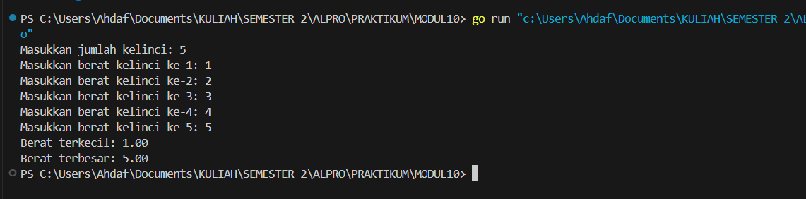
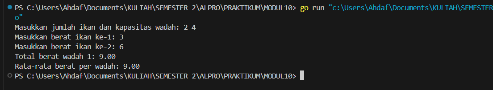
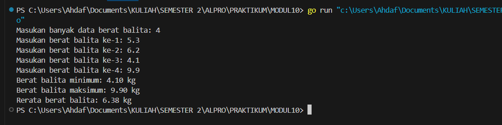

# MODUL 10

Rahmat Ahdaf Albariza (103112430003)
___
#### **nomor 1**
```go
package main

import "fmt"

func main() {
	var N int
	var berat [1000]float64

	fmt.Print("Masukkan jumlah kelinci: ")
	fmt.Scan(&N)

	for i := 0; i < N; i++ {
		fmt.Printf("Masukkan berat kelinci ke-%d: ", i+1)
		fmt.Scan(&berat[i])
	}

	min := berat[0]
	max := berat[0]

	for i := 1; i < N; i++ {
		if berat[i] < min {
			min = berat[i]
		}
		if berat[i] > max {
			max = berat[i]
		}
	}

	fmt.Printf("Berat terkecil: %.2f\n", min)
	fmt.Printf("Berat terbesar: %.2f\n", max)
}
```
Output:

>

Penjelasan:
Program di atas adalh program dalam bahasa Go dan bertujuan untuk mencari berat kelinci yang paling ringan dan paling berat dari sejumlah data yang dimasukkan oleh pengguna. Pertama, program meminta pengguna untuk memasukkan jumlah kelinci, kemudian melakukan input berat masing-masing kelinci satu per satu. Data berat tersebut disimpan dalam sebuah array bertipe `float64` agar bisa menyimpan angka desimal. Setelah semua data berat dimasukkan, program memulai proses pencarian nilai minimum (berat terkecil) dan maksimum (berat terbesar). Awalnya, nilai minimum dan maksimum diisi dengan berat kelinci pertama, lalu program membandingkannya dengan berat kelinci lainnya satu per satu menggunakan perulangan. Jika ditemukan berat yang lebih kecil atau lebih besar, maka nilai `min` atau `max` akan diperbarui. Terakhir, program mencetak hasil berat terkecil dan terbesar dengan format dua angka di belakang koma.

___
#### **nomor 2**
```go
package main

import "fmt"

func main() {
	var x, y int
	var berat [1000]float64

	fmt.Print("Masukkan jumlah ikan dan kapasitas wadah: ")
	fmt.Scan(&x, &y)

	for i := 0; i < x; i++ {
		fmt.Printf("Masukkan berat ikan ke-%d: ", i+1)
		fmt.Scan(&berat[i])
	}

	jumlahWadah := (x + y - 1) / y
	var totalWadah [1000]float64

	idx := 0
	for i := 0; i < jumlahWadah; i++ {
		var total float64 = 0
		for j := 0; j < y && idx < x; j++ {
			total += berat[idx]
			idx++
		}
		totalWadah[i] = total
	}

	var totalSemua float64 = 0
	for i := 0; i < jumlahWadah; i++ {
		fmt.Printf("Total berat wadah %d: %.2f\n", i+1, totalWadah[i])
		totalSemua += totalWadah[i]
	}

	rata := totalSemua / float64(jumlahWadah)
	fmt.Printf("Rata-rata berat per wadah: %.2f\n", rata)
}
```
Output:

>

Penjelasan:
Program di atas adalah program dalam bahasa go yang dibuat untuk menghitung total dan rata-rata berat ikan yang dimasukkan ke dalam beberapa wadah. Pengguna diminta untuk memasukkan jumlah ikan dan kapasitas (jumlah maksimal ikan) dalam satu wadah. Setelah itu, pengguna memasukkan berat dari masing-masing ikan satu per satu. Program akan membagi ikan-ikan tersebut ke dalam beberapa wadah secara berurutan, sesuai kapasitas yang telah ditentukan. Misalnya, jika kapasitas wadah adalah 3, maka setiap wadah bisa menampung hingga 3 ikan. Program kemudian menghitung total berat ikan di setiap wadah dan menyimpannya. Setelah semua wadah terisi, program akan menampilkan total berat masing-masing wadah dan menghitung rata-rata berat dari semua wadah. Program ini cocok untuk pemula karena memperkenalkan konsep dasar seperti array, perulangan bersarang, pengambilan input, dan logika pembagian kelompok data.

___
#### **nomor 3**
```go
package main

import "fmt"

type arrBalita [100]float64

func hitungMinMax(arr arrBalita, n int, bMin, bMax *float64) {
	*bMin = arr[0]
	*bMax = arr[0]
	for i := 1; i < n; i++ {
		if arr[i] < *bMin {
			*bMin = arr[i]
		}
		if arr[i] > *bMax {
			*bMax = arr[i]
		}
	}
}

func rerata(arr arrBalita, n int) float64 {
	var total float64 = 0
	for i := 0; i < n; i++ {
		total += arr[i]
	}
	return total / float64(n)
}

func main() {
	var berat arrBalita
	var n int

	fmt.Print("Masukan banyak data berat balita: ")
	fmt.Scan(&n)

	for i := 0; i < n; i++ {
		fmt.Printf("Masukan berat balita ke-%d: ", i+1)
		fmt.Scan(&berat[i])
	}

	var min, max float64
	hitungMinMax(berat, n, &min, &max)
	rata := rerata(berat, n)

	fmt.Printf("Berat balita minimum: %.2f kg\n", min)
	fmt.Printf("Berat balita maksimum: %.2f kg\n", max)
	fmt.Printf("Rerata berat balita: %.2f kg\n", rata)
}
```
Output:

>

Penjelasan:
Program di atas adalah program dalam bahasa go yang digunakan untuk menghitung berat minimum, maksimum, dan rata-rata dari sekumpulan data berat balita. Pertama, pengguna diminta untuk memasukkan jumlah data berat balita yang akan diinput. Setelah itu, program meminta pengguna untuk memasukkan berat masing-masing balita satu per satu. Data berat ini disimpan dalam array khusus yang diberi nama `arrBalita`. Program ini memiliki dua fungsi utama: `hitungMinMax` untuk mencari berat terkecil dan terbesar, serta `rerata` untuk menghitung rata-rata berat semua balita. Nilai minimum dan maksimum dihitung dengan membandingkan setiap data dalam array, sedangkan rata-rata dihitung dengan menjumlahkan semua berat lalu dibagi dengan jumlah balita. Hasil akhirnya, program menampilkan berat balita paling ringan, paling berat, dan rata-ratanya dalam satuan kilogram. Program ini sangat cocok untuk pemula karena memperkenalkan cara menggunakan array, fungsi, pointer, perulangan, dan operasi matematika sederhana dalam bahasa Go.

___
