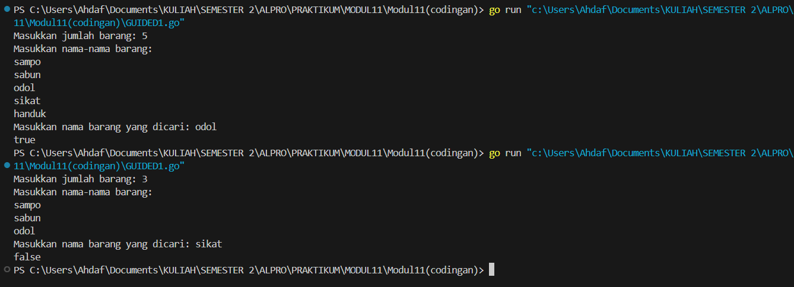
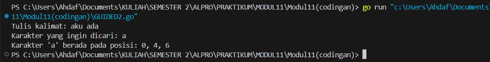
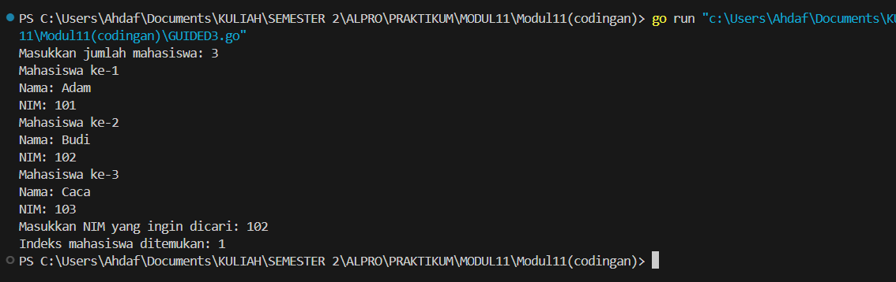
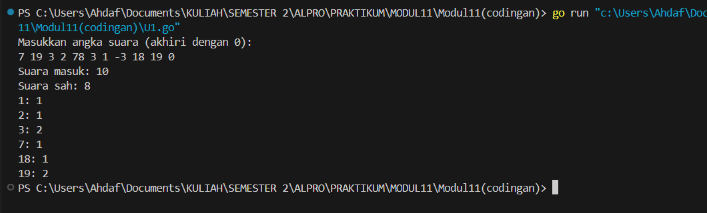
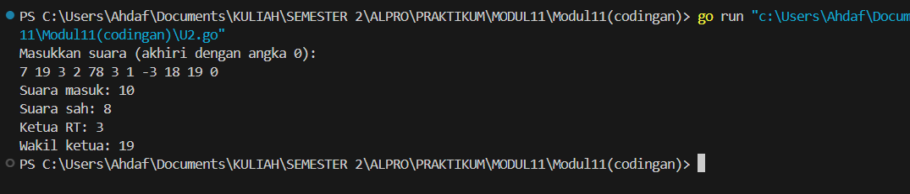
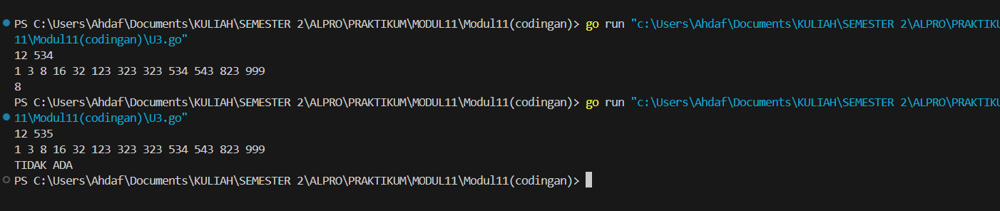

# MODUL 11
# PENCARIAN NILAI ACAK PADA HIMPUNAN DATA
___
Rahmat Ahdaf Albariza (103112430003)
___
# Dasar Teori
Pencarian nilai acak pada himpunan data melibatkan dua algoritma utama, yaitu Sequential Search dan Binary Search. Sequential Search memeriksa elemen satu per satu secara berurutan dan cocok untuk data yang tidak terurut. Sementara itu, Binary Search jauh lebih efisien namun hanya dapat digunakan pada data yang telah terurut, dengan membandingkan elemen tengah dan mempersempit ruang pencarian secara bertahap. Kedua algoritma ini dapat diterapkan pada array bertipe data dasar maupun struct, dengan penyesuaian pada field yang digunakan, terutama pada Binary Search yang mensyaratkan keterurutan data sesuai kunci pencarian.
___

# Guided
___
#### **nomor 1**
```go
package main

import "fmt"

func cariBarang(daftar []string, x string) bool {
    for _, barang := range daftar {
        if barang == x {
            return true
        }
    }
    return false
}

func main() {
    var n int
    fmt.Print("Masukkan jumlah barang: ")
    fmt.Scan(&n)

    daftarBarang := make([]string, n)
    fmt.Println("Masukkan nama-nama barang:")
    for i := 0; i < n; i++ {
        fmt.Scan(&daftarBarang[i])
    }

    var barangDicari string
    fmt.Print("Masukkan nama barang yang dicari: ")
    fmt.Scan(&barangDicari)

    ditemukan := cariBarang(daftarBarang, barangDicari)
    fmt.Println(ditemukan)
}
```
Output:

>

Penjelasan:
Program ini bertujuan untuk mencari apakah sebuah nama barang tertentu terdapat dalam daftar barang yang telah dimasukkan oleh pengguna. Pertama, pengguna diminta untuk menentukan jumlah barang yang akan dimasukkan, lalu dilanjutkan dengan input nama-nama barang tersebut satu per satu. Setelah seluruh data barang dimasukkan, pengguna diminta untuk mengetikkan nama barang yang ingin dicari. Program kemudian memeriksa keberadaan barang tersebut dalam daftar menggunakan metode pencarian sekuensial (sequential search), yaitu dengan memeriksa setiap elemen dalam daftar satu per satu. Jika barang ditemukan, program akan menampilkan `true`; jika tidak, maka hasilnya adalah `false`.
___
#### **nomor 2**
```go
package main

import (
	"bufio"
	"fmt"
	"os"
	"strings"
)

func tampilkanHasil(cari string, indeks []int) {
	if len(indeks) == 0 {
		fmt.Printf("Karakter '%s' tidak ditemukan dalam teks.\n", cari)
	} else {
		fmt.Printf("Karakter '%s' berada pada posisi: %s\n", cari, strings.Trim(strings.Replace(fmt.Sprint(indeks), " ", ", ", -1), "[]"))
	}
}

func main() {
	reader := bufio.NewReader(os.Stdin)
	fmt.Print("Tulis kalimat: ")
	input, _ := reader.ReadString('\n')
	input = strings.TrimSpace(input)

	var target string
	fmt.Print("Karakter yang ingin dicari: ")
	fmt.Scanln(&target)

	if len(target) != 1 {
		fmt.Println("Masukkan hanya satu karakter!")
		return
	}

	indeksTemuan := []int{}
	for pos, char := range input {
		if string(char) == target {
			indeksTemuan = append(indeksTemuan, pos)
		}
	}

	tampilkanHasil(target, indeksTemuan)
}
```
Output:

>

Penjelasan:
Program ini bertujuan untuk mencari posisi kemunculan sebuah karakter tertentu di dalam sebuah kalimat yang dimasukkan oleh pengguna. Pertama, pengguna diminta untuk mengetikkan sebuah kalimat, kemudian diikuti dengan input satu karakter yang ingin dicari. Program akan memeriksa setiap karakter dalam kalimat tersebut satu per satu dan mencatat semua posisi di mana karakter yang dicari muncul. Posisi dihitung mulai dari indeks 0. Jika karakter ditemukan, program akan menampilkan daftar indeks tempat karakter tersebut muncul. Namun, jika tidak ditemukan, program akan menampilkan pesan bahwa karakter tersebut tidak ada dalam kalimat. Pencarian dilakukan dengan metode pencarian sekuensial dan hasilnya ditampilkan dalam format yang rapi.

___
#### **nomor 3**
```go
package main

import (
	"fmt"
)

type Mahasiswa struct {
	nama string
	nim  string
}

func binarySearch(mahasiswa []Mahasiswa, x string) int {
	low := 0
	high := len(mahasiswa) - 1

	for low <= high {
		mid := (low + high) / 2
		if mahasiswa[mid].nim == x {
			return mid
		} else if mahasiswa[mid].nim < x {
			low = mid + 1
		} else {
			high = mid - 1
		}
	}

	return -1
}

func main() {
	var n int
	fmt.Print("Masukkan jumlah mahasiswa: ")
	fmt.Scanln(&n)

	mahasiswa := make([]Mahasiswa, n)
	for i := 0; i < n; i++ {
		fmt.Printf("Mahasiswa ke-%d\n", i+1)
		fmt.Print("Nama: ")
		fmt.Scanln(&mahasiswa[i].nama)
		fmt.Print("NIM: ")
		fmt.Scanln(&mahasiswa[i].nim)
	}

	var x string
	fmt.Print("Masukkan NIM yang ingin dicari: ")
	fmt.Scanln(&x)

	index := binarySearch(mahasiswa, x)
	if index != -1 {
		fmt.Printf("Indeks mahasiswa ditemukan: %d\n", index)
	} else {
		fmt.Println("NIM tidak ditemukan.")
	}
}
```
Output:

>

Penjelasan:
Program ini bertujuan untuk mencari posisi seorang mahasiswa berdasarkan NIM-nya dari daftar mahasiswa yang telah dimasukkan oleh pengguna. Pertama, pengguna diminta untuk menentukan jumlah mahasiswa, lalu memasukkan data nama dan NIM untuk masing-masing mahasiswa. Setelah semua data tersimpan, pengguna diminta untuk mengetikkan NIM yang ingin dicari. Program kemudian melakukan pencarian menggunakan metode binary search, yaitu teknik pencarian yang efisien dengan membandingkan NIM di posisi tengah dari daftar yang sudah terurut berdasarkan NIM. Jika NIM yang dicari ditemukan, program akan menampilkan indeks posisi mahasiswa tersebut dalam daftar. Namun, jika tidak ditemukan, program akan menampilkan pesan bahwa NIM tersebut tidak ada dalam data yang dimasukkan.

___


# Unguided
___
#### **nomor 1**
>Pada pemilihan ketua RT yang baru saja berlangsung, terdapat 20 calon ketua yang bertanding memperebutkan suara warga. Perhitungan suara dapat segera dilakukan karena warga cukup mengisi formulir dengan nomor dari calon ketua RT yang dipilihnya. Seperti biasa, selalu ada pengisian yang tidak tepat atau dengan nomor pilihan di luar yang tersedia, sehingga data juga harus divalidasi. Tugas Anda untuk membuat program mencari siapa yang memenangkan pemilihan ketua RT. Buatlah program pilkart yang akan membaca, memvalidasi, dan menghitung suara yang diberikan dalam pemilihan ketua RT tersebut. 
>**Masukan** :  hanya satu baris data saja, berisi bilangan bulat valid yang kadang tersisipi dengan data tidak valid. Data valid adalah integer dengan nilai di antara 1 s.d. 20 (inklusif). Data berakhir jika ditemukan sebuah bilangan dengan nilai 0. 
>**Keluaran** : dimulai dengan baris berisi jumlah data suara yang terbaca, diikuti baris yang berisi berapa banyak suara yang valid. Kemudian sejumlah baris yang mencetak data para calon apa saja yang mendapatkan suara.

```go
package main

import (
	"fmt"
)

const maksimalCalon = 20

func inputSuara() []int {
	var suara int
	var data []int

	fmt.Println("Masukkan angka suara (akhiri dengan 0):")
	for {
		fmt.Scan(&suara)
		if suara == 0 {
			break
		}
		data = append(data, suara)
	}
	return data
}

func hitungSuara(data []int) ([21]int, int) {
	var hasil [21]int
	valid := 0

	for _, suara := range data {
		if suara >= 1 && suara <= maksimalCalon {
			hasil[suara]++
			valid++
		}
	}

	return hasil, valid
}

func tampilkanHasil(total, sah int, hasil [21]int) {
	fmt.Println("Suara masuk:", total)
	fmt.Println("Suara sah:", sah)
	for i := 1; i <= maksimalCalon; i++ {
		if hasil[i] > 0 {
			fmt.Printf("%d: %d\n", i, hasil[i])
		}
	}
}

func main() {
	dataSuara := inputSuara()
	hasilSuara, jumlahSah := hitungSuara(dataSuara)
	tampilkanHasil(len(dataSuara), jumlahSah, hasilSuara)
}
```
Output:

>

Penjelasan:
Program ini bertujuan untuk menghitung dan menampilkan jumlah suara yang diperoleh masing-masing calon ketua RT dalam sebuah proses pemungutan suara. Pertama, pengguna diminta untuk memasukkan angka-angka suara satu per satu, yang mewakili nomor calon ketua RT, dan diakhiri dengan angka 0 sebagai tanda berhenti. Program kemudian akan memvalidasi setiap suara, hanya menghitung suara yang berada dalam rentang 1 hingga 20 sebagai suara sah. Suara yang valid akan dihitung dan disimpan dalam array berdasarkan nomor calon. Setelah seluruh suara dihitung, program akan menampilkan total suara masuk, jumlah suara sah, dan jumlah suara yang diterima oleh masing-masing calon yang mendapatkan suara.
___
#### **nomor 2**
>Berdasarkan program sebelumnya, buat program pilkart yang mencari siapa pemenang pemilihan ketua RT. Sekaligus juga ditentukan bahwa wakil ketua RT adalah calon yang mendapatkan suara terbanyak kedua. Jika beberapa calon mendapatkan suara terbanyak yang sama, ketua terpilih adalah dengan nomor peserta yang paling kecil dan wakilnya dengan nomor peserta terkecil berikutnya. 
>**Masukan** : hanya satu baris data saja, berisi bilangan bulat valid yang kadang tersisipi dengan data tidak valid. Data valid adalah bilangan bulat dengan nilai di antara 1 s.d. 20 (inklusif). Data berakhir jika ditemukan sebuah bilangan dengan nilai 0. 
>**Keluaran** : dimulai dengan baris berisi jumlah data suara yang terbaca, diikuti baris yang berisi berapa banyak suara yang valid. Kemudian tercetak calon nomor berapa saja yang menjadi pasangan ketua RT dan wakil ketua RT yang baru

```go
package main

import (
	"fmt"
)

func inputSuara() []int {
	var suara int
	var data []int

	fmt.Println("Masukkan suara (akhiri dengan angka 0):")
	for {
		fmt.Scan(&suara)
		if suara == 0 {
			break
		}
		data = append(data, suara)
	}
	return data
}

func hitungSuara(data []int) ([21]int, int) {
	var hasil [21]int
	valid := 0

	for _, suara := range data {
		if suara >= 1 && suara <= 20 {
			hasil[suara]++
			valid++
		}
	}
	return hasil, valid
}

func cariKetuaWakil(hasil [21]int) (int, int) {
	max1, max2 := 0, 0
	var calonMax1, calonMax2 []int

	// Cari max1 dan max2
	for i := 1; i <= 20; i++ {
		if hasil[i] > max1 {
			max2 = max1
			calonMax2 = calonMax1

			max1 = hasil[i]
			calonMax1 = []int{i}
		} else if hasil[i] == max1 {
			calonMax1 = append(calonMax1, i)
		} else if hasil[i] > max2 {
			max2 = hasil[i]
			calonMax2 = []int{i}
		} else if hasil[i] == max2 {
			calonMax2 = append(calonMax2, i)
		}
	}

	// Ketua = calon suara terbanyak dengan nomor terkecil
	ketua := calonMax1[0]
	for _, c := range calonMax1 {
		if c < ketua {
			ketua = c
		}
	}

	// Wakil = cari dari kandidat max1 yang lebih besar dari ketua,
	// atau kandidat max2 dengan nomor terkecil
	wakil := 0
	for _, c := range calonMax1 {
		if c > ketua {
			if wakil == 0 || c < wakil {
				wakil = c
			}
		}
	}
	if wakil == 0 && len(calonMax2) > 0 {
		wakil = calonMax2[0]
		for _, c := range calonMax2 {
			if c < wakil {
				wakil = c
			}
		}
	}

	return ketua, wakil
}

func main() {
	dataSuara := inputSuara()
	hasilSuara, suaraSah := hitungSuara(dataSuara)

	fmt.Println("Suara masuk:", len(dataSuara))
	fmt.Println("Suara sah:", suaraSah)

	ketua, wakil := cariKetuaWakil(hasilSuara)
	fmt.Println("Ketua RT:", ketua)
	fmt.Println("Wakil ketua:", wakil)
}
```
Output:

>

Penjelasan:
Program ini bertujuan untuk menentukan ketua dan wakil ketua RT berdasarkan hasil pemungutan suara yang dimasukkan oleh pengguna. Pengguna diminta untuk memasukkan sejumlah angka suara yang mewakili nomor calon ketua RT, dan proses input akan berhenti saat pengguna memasukkan angka 0. Program kemudian menghitung jumlah suara sah untuk setiap calon dengan memvalidasi bahwa hanya suara bernilai antara 1 hingga 20 yang dianggap valid. Setelah semua suara dihitung, program mencari dua calon dengan suara terbanyak. Calon dengan suara terbanyak dan nomor peserta terkecil akan ditetapkan sebagai ketua, sedangkan wakil ketua dipilih dari calon dengan suara terbanyak berikutnya, atau dari calon dengan suara yang sama namun memiliki nomor peserta lebih besar dari ketua. Hasil akhir yang ditampilkan adalah jumlah total suara masuk, jumlah suara sah, serta nomor calon yang terpilih sebagai ketua dan wakil ketua RT.

___
#### **nomor 3**
>Diberikan n data integer positif dalam keadaan terurut membesar dan sebuah integer lain k, apakah bilangan k tersebut ada dalam daftar bilangan yang diberikan? Jika ya, berikan indeksnya, jika tidak sebutkan "TIDAK ADA". 
>**Masukan** : terdiri dari dua baris. Baris pertama berisi dua buah integer positif, yaitu n dan k. n menyatakan banyaknya data, dimana 1 < n <= 1000000. k adalah bilangan yang ingin dicari. Baris kedua berisi n buah data integer positif yang sudah terurut membesar. 
>**Keluaran** : terdiri dari satu baris saja, yaitu sebuah bilangan yang menyatakan posisi data yang dicari (k) dalam kumpulan data yang diberikan. Posisi data dihitung dimulai dari angka 0. Atau memberikan keluaran "TIDAK ADA" jika data k tersebut tidak ditemukan dalam kumpulan.

```go
package main

import "fmt"

const NMAX = 1000000
var data [NMAX]int

func main() {
	var n, k int

	// Baca input n dan k
	fmt.Scan(&n, &k)

	// Isi array data
	isiArray(n)

	// Cari posisi k
	pos := posisi(n, k)

	// Cetak hasil
	if pos == -1 {
		fmt.Println("TIDAK ADA")
	} else {
		fmt.Println(pos)
	}
}

// Fungsi untuk mengisi array dari input
func isiArray(n int) {
	for i := 0; i < n; i++ {
		fmt.Scan(&data[i])
	}
}

// Fungsi binary search
func posisi(n, k int) int {
	kiri := 0
	kanan := n - 1

	for kiri <= kanan {
		tengah := (kiri + kanan) / 2
		if data[tengah] == k {
			return tengah
		} else if data[tengah] < k {
			kiri = tengah + 1
		} else {
			kanan = tengah - 1
		}
	}
	return -1
}
```
Output:

>

Penjelasan:
Program ini bertujuan untuk mencari apakah sebuah bilangan tertentu terdapat dalam kumpulan bilangan yang telah dimasukkan oleh pengguna, dan jika ada, menentukan posisi indeksnya. Pertama, pengguna diminta untuk memasukkan dua buah bilangan, yaitu `n` yang menyatakan jumlah data, dan `k` yang merupakan bilangan yang ingin dicari. Selanjutnya, pengguna memasukkan `n` buah bilangan yang diasumsikan sudah terurut membesar. Program menyimpan semua bilangan tersebut ke dalam array, kemudian melakukan pencarian menggunakan metode binary search. Metode ini bekerja dengan membagi dua rentang pencarian dan membandingkan elemen tengah dengan nilai yang dicari. Jika ditemukan, program akan mencetak indeks posisi bilangan tersebut; jika tidak, akan ditampilkan pesan "TIDAK ADA".