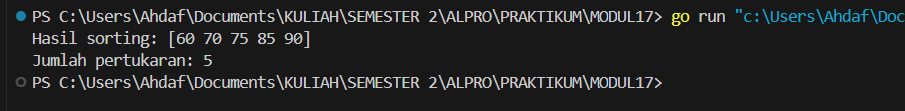
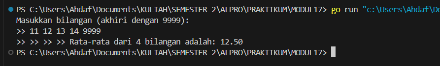
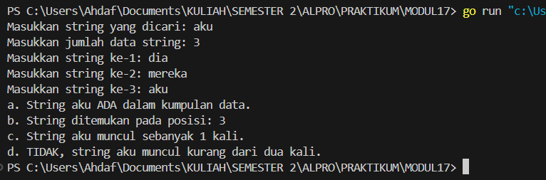
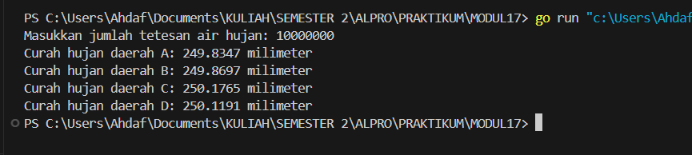
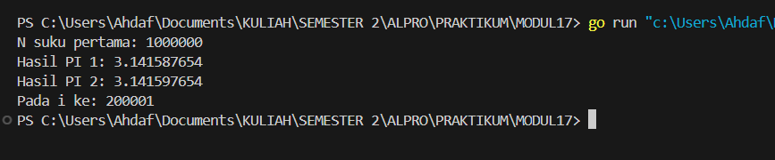
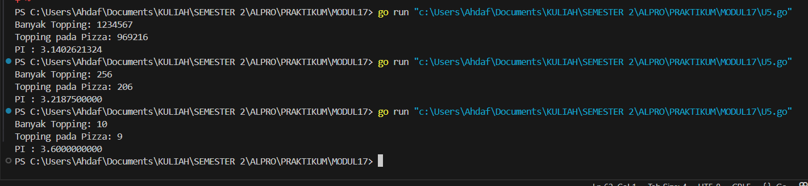

# MODUL 17
# SKEMA PEMROSESAN SEKUENSIAL
___
Rahmat Ahdaf Albariza (103112430003)
___
# Dasar Teori
Skema pemrosesan sekuensial merupakan salah satu pola dasar dalam pengembangan algoritma, di mana data diproses satu per satu sesuai dengan urutan kedatangannya. Pendekatan ini sangat umum digunakan dalam pemrograman imperatif atau prosedural, karena mencerminkan cara kerja komputer dalam mengeksekusi instruksi secara berurutan.
___

# Guided
___
#### **nomor 1**
>Aldi memiliki daftar nilai ulangan matematika temannya: 75, 60, 90, 85, dan 70. Ia ingin mengurutkan nilai tersebut dari yang terkecil ke yang terbesar menggunakan metode Bubble Sort. Pertanyaan:
>1. Tunjukkan proses pengurutan nilai menggunakan Bubble Sort hingga semua nilai terurut.
>2. Berapa kali pertukaran (swap) terjadi dalam proses ini?
```go
package main

import "fmt"

func BubbleSort(array []int) ([]int, int) {
	pertukaran := 0
	for i := 0; i < len(array)-1; i++ {
		for j := 0; j < len(array)-i-1; j++ {
			if array[j] > array[j+1] {
				array[j], array[j+1] = array[j+1], array[j]
				pertukaran++
			}
		}
	}
	return array, pertukaran
}
func main() {
	array := []int{75, 60, 90, 85, 70}
	arrayTerurut, pertukaran := BubbleSort(array)
	fmt.Println("Hasil sorting:", arrayTerurut)
	fmt.Println("Jumlah pertukaran:", pertukaran)

}

```
Output:

>

Penjelasan:
Program ini menggunakan metode _Bubble Sort_ untuk mengurutkan elemen dalam array dari yang terkecil ke terbesar. Di dalam fungsi `BubbleSort`, dua _loop_ digunakan untuk membandingkan dan menukar elemen jika elemen sebelumnya lebih besar dari elemen sesudahnya. Setiap kali terjadi pertukaran, penghitung `pertukaran` akan bertambah satu. Setelah proses pengurutan selesai, program mencetak array yang sudah terurut beserta total jumlah pertukaran yang terjadi selama proses tersebut.
___


# Unguided
___
#### **nomor 1**
>Diberikan sejumlah bilangan real yang diakhiri dengan marker 9999, cari rerata dari bilanganbilangan tersebut.

```go
package main

import "fmt"

func main() {
    var angka float64
    var total float64 = 0
    var jumlah int = 0

    fmt.Println("Masukkan bilangan (akhiri dengan 9999):")
    for {
        fmt.Print(">> ")
        fmt.Scan(&angka)

        if angka == 9999 {
            break
        }

        total += angka
        jumlah++
    }

    if jumlah > 0 {
        rataRata := total / float64(jumlah)
        fmt.Printf("Rata-rata dari %d bilangan adalah: %.2f\n", jumlah, rataRata)
    } else {
        fmt.Println("Tidak ada bilangan yang dimasukkan.")
    }
}

```
Output:

>

Penjelasan:
Program ini meminta pengguna untuk memasukkan sejumlah bilangan satu per satu, dan akan berhenti ketika pengguna memasukkan angka 9999 sebagai tanda akhir. Selama proses, program menghitung total nilai dan jumlah bilangan yang dimasukkan. Setelah input selesai, program menghitung dan menampilkan rata-rata dari bilangan yang dimasukkan, atau menampilkan pesan jika tidak ada bilangan yang dimasukkan.
___
#### **nomor 2**
>Diberikan string x dan n buah string. x adalah data pertama yang dibaca, n adalah data bilangan yang dibaca kedua, dan n data berikutnya adalah data string. Buat algoritma untuk menjawab pertanyaan berikut: 
>a. Apakah string x ada dalam kumpulan n data string tersebut? 
>b. Pada posisi ke berapa string x tersebut ditemukan? 
>c. Ada berapakah string x dalam kumpulan n data string tersebut? 
>d. Adakah sedikitnya dua string x dalam n data string tersebut?

```go
package main

import (
	"fmt"
)

func cariString(target string, banyak int) {
	var posisi []int

	for i := 1; i <= banyak; i++ {
		var input string
		fmt.Print("Masukkan string ke-", i, ": ")
		fmt.Scanln(&input)
		if input == target {
			posisi = append(posisi, i)
		}
	}

	// a. Apakah string x ada dalam kumpulan?
	if len(posisi) > 0 {
		fmt.Println("a. String", target, "ADA dalam kumpulan data.")
	} else {
		fmt.Println("a. String", target, "TIDAK ADA dalam kumpulan data.")
	}

	// b. Posisi string x
	if len(posisi) > 0 {
		fmt.Print("b. String ditemukan pada posisi: ")
		for i, p := range posisi {
			if i > 0 {
				fmt.Print(", ")
			}
			fmt.Print(p)
		}
		fmt.Println()
	} else {
		fmt.Println("b. Tidak ditemukan posisi karena string tidak ada.")
	}

	// c. Jumlah kemunculan string x
	fmt.Println("c. String", target, "muncul sebanyak", len(posisi), "kali.")

	// d. Apakah muncul setidaknya dua kali?
	if len(posisi) >= 2 {
		fmt.Println("d. YA, string", target, "muncul setidaknya dua kali.")
	} else {
		fmt.Println("d. TIDAK, string", target, "muncul kurang dari dua kali.")
	}
}

func main() {
	var target string
	var banyak int

	fmt.Print("Masukkan string yang dicari: ")
	fmt.Scanln(&target)

	fmt.Print("Masukkan jumlah data string: ")
	fmt.Scanln(&banyak)

	cariString(target, banyak)
}

```
Output:

>

Penjelasan:
Program ini mencari kemunculan sebuah string tertentu dalam sejumlah data string yang dimasukkan oleh pengguna. Pengguna pertama-tama diminta memasukkan string target dan jumlah data yang akan dimasukkan. Selanjutnya, program mencatat posisi setiap kemunculan string target. Setelah semua data dimasukkan, program menampilkan apakah string target ada, di posisi mana saja ditemukan, berapa kali muncul, dan apakah muncul setidaknya dua kali.

___
#### **nomor 3**
>Empat daerah A, B, C, dan D yang berdekatan ingin mengukur curah hujan. Keempat daerah tersebut digambarkan pada bidang berikut: Misal curah hujan dihitung berdasarkan banyaknya tetesan air hujan. Setiap tetesan berukuran 0.0001 ml curah hujan. Tetesan air hujan turun secara acak dari titik (0,0) sampai (1,1). Jika diterima input yang menyatakan banyaknya tetesan air hujan. Tentukan curah hujan untuk keempat daerah tersebut.
>Buatlah program yang menerima input berupa banyaknya tetesan air hujan. Kemudian buat koordinat/titik (x, y) secara acak dengan menggunakan fungsi rand.Float64(). Hitung dan tampilkan banyaknya tetesan yang jatuh pada daerah A, B, C dan D. Konversikan satu tetesan berukuran 0.0001 milimeter.
>Catatan: Lihat lampiran untuk informasi menggunakan paket math/rand untuk menggunakan rand.Float64() yang menghasilkan bilangan riil acak 0..1

```go
package main

import (
	"fmt"
	"math/rand"
	"time"
)

// Fungsi untuk membaca jumlah tetesan air hujan
func inisialisasi() int {
	var jumlahTetesan int
	fmt.Print("Masukkan jumlah tetesan air hujan: ")
	fmt.Scan(&jumlahTetesan)
	return jumlahTetesan
}

// Fungsi untuk menghitung jumlah tetesan di masing-masing daerah
func tetesHujan(jumlahTetesan int) (int, int, int, int) {
	var daerahA, daerahB, daerahC, daerahD int

	for i := 0; i < jumlahTetesan; i++ {
		x := rand.Float64()
		y := rand.Float64()

		if x < 0.5 && y < 0.5 {
			// Daerah A: kiri bawah
			daerahA++
		} else if x >= 0.5 && y < 0.5 {
			// Daerah B: kanan bawah
			daerahB++
		} else if x < 0.5 && y >= 0.5 {
			// Daerah D: kiri atas
			daerahD++
		} else {
			// Daerah C: kanan atas
			daerahC++
		}
	}

	return daerahA, daerahB, daerahC, daerahD
}

// Fungsi untuk menghitung curah hujan tiap daerah
func hitungCurahHujan(daerahA, daerahB, daerahC, daerahD int, ukuranTetesan float64) (float64, float64, float64, float64) {
	curahA := float64(daerahA) * ukuranTetesan
	curahB := float64(daerahB) * ukuranTetesan
	curahC := float64(daerahC) * ukuranTetesan
	curahD := float64(daerahD) * ukuranTetesan
	return curahA, curahB, curahC, curahD
}

// Fungsi untuk menampilkan hasil
func tampilkanHasil(curahA, curahB, curahC, curahD float64) {
	fmt.Printf("Curah hujan daerah A: %.4f milimeter\n", curahA)
	fmt.Printf("Curah hujan daerah B: %.4f milimeter\n", curahB)
	fmt.Printf("Curah hujan daerah C: %.4f milimeter\n", curahC)
	fmt.Printf("Curah hujan daerah D: %.4f milimeter\n", curahD)
}

func main() {
	rand.Seed(time.Now().UnixNano()) // Inisialisasi seed random

	const ukuranTetesan = 0.0001 // Ukuran satu tetes hujan

	jumlahTetesan := inisialisasi() // Baca input
	a, b, c, d := tetesHujan(jumlahTetesan) // Hitung tetesan per daerah
	curahA, curahB, curahC, curahD := hitungCurahHujan(a, b, c, d, ukuranTetesan) // Hitung curah hujan
	tampilkanHasil(curahA, curahB, curahC, curahD) // Tampilkan hasil
}

```
Output:

>

Penjelasan:
Program ini mensimulasikan penyebaran tetesan air hujan ke empat daerah (A, B, C, dan D) berdasarkan koordinat acak. Pengguna diminta memasukkan jumlah tetesan hujan, lalu program menentukan ke daerah mana setiap tetesan jatuh berdasarkan nilai acak koordinat x dan y. Setelah itu, program menghitung curah hujan di setiap daerah dengan mengalikan jumlah tetesan dengan ukuran satu tetesan, dan menampilkan hasil curah hujan masing-masing daerah dalam satuan milimeter.
___
#### **nomor 4**
>

```go
package main

import (
	"fmt"
	"math"
)

// Fungsi untuk input batas maksimum iterasi
func inisialisasi() int {
	var n int
	fmt.Print("N suku pertama: ")
	fmt.Scan(&n)
	return n
}

// Fungsi untuk menghitung PI dan berhenti jika dua hasil PI berturut-turut memiliki selisih < 0.00001
func hitungPIDenganBatas(n int) (float64, float64, int) {
	var sum float64 = 0.0
	var piSebelumnya float64 = 0.0
	var piSekarang float64 = 0.0
	var i int = 0

	for i = 0; i < n; i++ {
		if i%2 == 0 {
			sum += 1.0 / float64(2*i+1)
		} else {
			sum -= 1.0 / float64(2*i+1)
		}

		piSekarang = sum * 4

		if i > 0 {
			selisih := math.Abs(piSekarang - piSebelumnya)
			if selisih < 0.00001 {
				break
			}
		}

		piSebelumnya = piSekarang
	}

	return piSebelumnya, piSekarang, i + 1
}

func tampilkanHasil(pi1, pi2 float64, padaSuku int) {
	fmt.Printf("Hasil PI 1: %.9f\n", pi1)
	fmt.Printf("Hasil PI 2: %.9f\n", pi2)
	fmt.Printf("Pada i ke: %d\n", padaSuku)
}

func main() {
	n := inisialisasi()
	pi1, pi2, i := hitungPIDenganBatas(n)
	tampilkanHasil(pi1, pi2, i)
}

```
Output:

>

Penjelasan:
Program ini menghitung nilai pendekatan PI menggunakan deret Leibniz hingga mencapai jumlah suku maksimum yang ditentukan pengguna atau hingga dua hasil PI berturut-turut memiliki selisih kurang dari 0.00001. Dalam setiap iterasi, nilai PI dihitung dari penjumlahan dan pengurangan pecahan dengan pola tertentu, lalu dikalikan 4. Jika selisih dua nilai PI terakhir sudah cukup kecil, program menghentikan perhitungan lebih awal dan menampilkan dua nilai PI terakhir beserta posisi iterasi saat berhenti.
___
#### **nomor 5**
>

```go
package main

import (
	"fmt"
	"math/rand"
	"time"
)

// Inisialisasi seed random dengan waktu saat ini
func inisialisasi() {
	rand.Seed(time.Now().UnixNano())
}

// Fungsi untuk membaca jumlah topping dari input
func ambilTopping() int {
	var jumlah int
	fmt.Print("Banyak Topping: ")
	fmt.Scan(&jumlah)
	return jumlah
}

// Fungsi untuk mengecek apakah titik (x, y) berada di dalam lingkaran pizza
func cekDiPizza(x, y, cx, cy, r float64) bool {
	return (x-cx)*(x-cx)+(y-cy)*(y-cy) <= r*r
}

// Fungsi untuk menghitung berapa banyak topping yang jatuh di pizza
func hitungTopping(n int, cx, cy, r float64) int {
	toppingCount := 0
	for i := 0; i < n; i++ {
		x := rand.Float64()
		y := rand.Float64()

		if cekDiPizza(x, y, cx, cy, r) {
			toppingCount++
		}
	}
	return toppingCount
}

// Fungsi untuk memperkirakan nilai PI berdasarkan hasil simulasi
func perkirakanPI(n, count int) float64 {
	return float64(count) / float64(n) * 4
}

// Fungsi utama
func main() {
	inisialisasi()

	n := ambilTopping()

	// Titik pusat pizza di (0.5, 0.5) dan radius 0.5
	cx, cy, r := 0.5, 0.5, 0.5

	toppingCount := hitungTopping(n, cx, cy, r)

	fmt.Printf("Topping pada Pizza: %d\n", toppingCount)

	pi := perkirakanPI(n, toppingCount)
	fmt.Printf("PI : %.10f\n", pi)
}

```
Output:

>

Penjelasan:
Program ini mensimulasikan penempatan acak topping di atas sebuah bidang persegi dengan lingkaran pizza di tengahnya, lalu memperkirakan nilai PI. Pengguna diminta memasukkan jumlah topping, lalu program secara acak menempatkan titik-titik dan menghitung berapa yang jatuh di dalam lingkaran (pizza). Rasio titik yang berada di dalam lingkaran dibanding total titik digunakan untuk menghitung pendekatan nilai PI dengan rumus: (topping dalam lingkaran / total topping) × 4. Hasil simulasi kemudian ditampilkan.