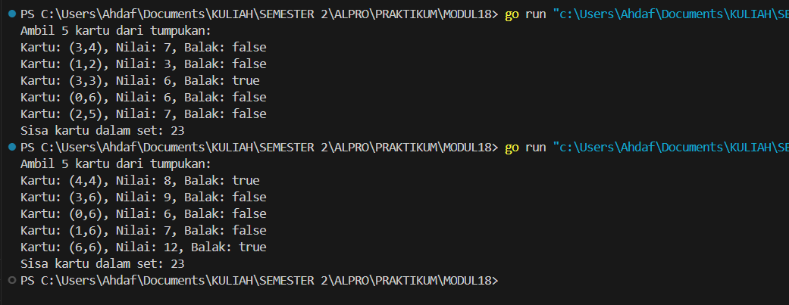
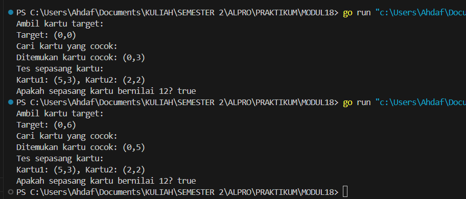
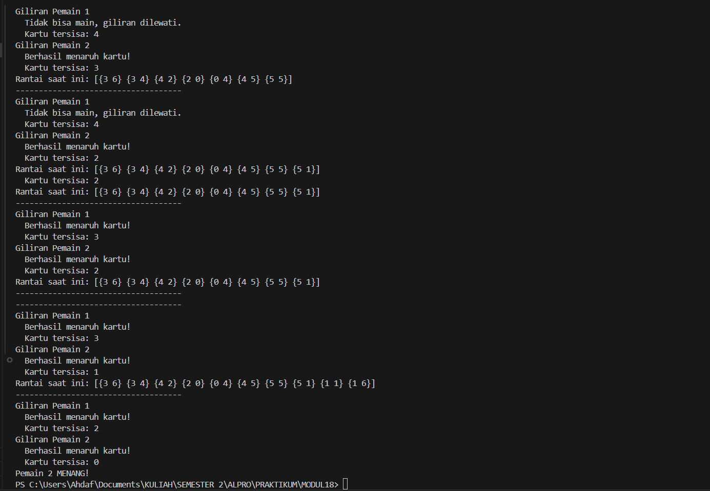
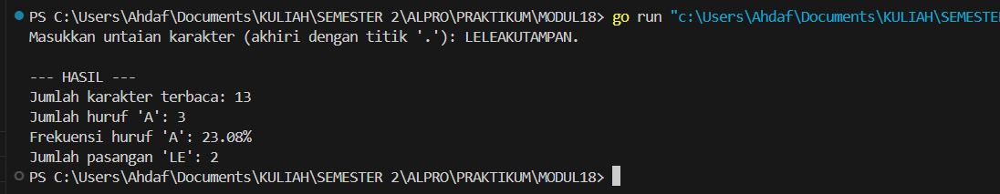

# MODUL 18
# MESIN ABSTRAK
___
Rahmat Ahdaf Albariza (103112430003)
___
# Dasar Teori
Mesin abstrak adalah model komputasi yang menyederhanakan proses pengolahan data dengan menggunakan tipe data dan operasi dasar yang telah ditentukan, sehingga memudahkan dalam merancang dan menganalisis algoritma tanpa bergantung pada detail perangkat keras. Mesin ini berfungsi sebagai lapisan abstraksi yang memungkinkan pengembangan sistem atau aplikasi dengan cara memanipulasi data melalui aturan dan operasi yang terstruktur, contohnya seperti mesin domino yang menggunakan kartu dengan nilai pip dan operasi pengocokan, pengambilan, serta pengecekan nilai untuk berbagai permainan.
___

#### **nomor 1**
>

```go
package main

import (
	"fmt"
	"math/rand"
	"time"
)

// Tipe data untuk satu kartu domino
type Domino struct {
	Suit1  int  // sisi pertama
	Suit2  int  // sisi kedua
	Nilai  int  // total nilai = Suit1 + Suit2
	Balak  bool // apakah kartu ini balak (kedua sisi sama)
}

// Tipe data untuk satu set kartu domino
type Dominoes struct {
	Kartu     [28]Domino // array dari 28 kartu
	Jumlah    int        // jumlah kartu tersisa
}

// Inisialisasi set kartu domino
func buatSetKartu() Dominoes {
	var set Dominoes
	idx := 0
	for i := 0; i <= 6; i++ {
		for j := i; j <= 6; j++ {
			kartu := Domino{
				Suit1: i,
				Suit2: j,
				Nilai: i + j,
				Balak: i == j,
			}
			set.Kartu[idx] = kartu
			idx++
		}
	}
	set.Jumlah = 28
	return set
}

// Prosedur untuk mengocok kartu (shuffle)
func kocokKartu(d *Dominoes) {
	rand.Seed(time.Now().UnixNano())
	for i := range d.Kartu {
		j := rand.Intn(i + 1)
		d.Kartu[i], d.Kartu[j] = d.Kartu[j], d.Kartu[i]
	}
}

// Fungsi untuk mengambil satu kartu dari tumpukan
func ambilKartu(d *Dominoes) Domino {
	if d.Jumlah == 0 {
		return Domino{}
	}
	kartu := d.Kartu[d.Jumlah-1]
	d.Jumlah--
	return kartu
}

// Fungsi untuk mendapatkan salah satu sisi gambar kartu (suit)
func gambarKartu(k Domino, suit int) int {
	if suit == 1 {
		return k.Suit1
	}
	return k.Suit2
}

// Fungsi untuk mendapatkan nilai kartu
func nilaiKartu(k Domino) int {
	return k.Nilai
}

// Contoh penggunaan
func main() {
	dominoSet := buatSetKartu()
	kocokKartu(&dominoSet)

	fmt.Println("Ambil 5 kartu dari tumpukan:")

	for i := 0; i < 5; i++ {
		kartu := ambilKartu(&dominoSet)
		fmt.Printf("Kartu: (%d,%d), Nilai: %d, Balak: %v\n",
			kartu.Suit1, kartu.Suit2, nilaiKartu(kartu), kartu.Balak)
	}

	fmt.Printf("Sisa kartu dalam set: %d\n", dominoSet.Jumlah)
}

```
Output:

>

Penjelasan:
Program ini mengimplementasikan mesin abstrak untuk permainan kartu domino dengan operasi dasar seperti inisialisasi set kartu, pengacakan, pengambilan kartu, serta pengecekan nilai dan sisi kartu. Struktur `Domino` menyimpan informasi dua sisi kartu, nilai total, dan apakah kartu tersebut balak. Struktur `Dominoes` mewakili tumpukan kartu berisi 28 kartu unik. Fungsi `buatSetKartu` menghasilkan semua kombinasi kartu domino, `kocokKartu` mengacak urutannya secara acak, `ambilKartu` mengurangi tumpukan sambil mengembalikan satu kartu teratas, `gambarKartu` mengambil nilai sisi tertentu, dan `nilaiKartu` menghitung total nilainya. Fungsi `main` menunjukkan penggunaan semua operasi ini dengan mengambil lima kartu secara acak dan mencetak informasi setiap kartu ke layar.
___
#### **nomor 2**
>

```go
package main

import (
	"fmt"
	"math/rand"
	"time"
)

type Domino struct {
	Suit1 int
	Suit2 int
	Nilai int
	Balak bool
}

type Dominoes struct {
	Kartu  [28]Domino
	Jumlah int
}

func buatSetKartu() Dominoes {
	var set Dominoes
	idx := 0
	for i := 0; i <= 6; i++ {
		for j := i; j <= 6; j++ {
			kartu := Domino{
				Suit1: i,
				Suit2: j,
				Nilai: i + j,
				Balak: i == j,
			}
			set.Kartu[idx] = kartu
			idx++
		}
	}
	set.Jumlah = 28
	return set
}

func kocokKartu(d *Dominoes) {
	rand.Seed(time.Now().UnixNano())
	for i := range d.Kartu {
		j := rand.Intn(i + 1)
		d.Kartu[i], d.Kartu[j] = d.Kartu[j], d.Kartu[i]
	}
}

func ambilKartu(d *Dominoes) Domino {
	if d.Jumlah == 0 {
		return Domino{}
	}
	kartu := d.Kartu[d.Jumlah-1]
	d.Jumlah--
	return kartu
}

func nilaiKartu(k Domino) int {
	return k.Nilai
}

// 2.a. Prosedur galiKartu
func galiKartu(d *Dominoes, target Domino) (Domino, bool) {
	for d.Jumlah > 0 {
		kartu := ambilKartu(d)
		if kartu.Suit1 == target.Suit1 || kartu.Suit1 == target.Suit2 ||
			kartu.Suit2 == target.Suit1 || kartu.Suit2 == target.Suit2 {
			return kartu, true
		}
	}
	return Domino{}, false
}

// 2.b. Fungsi sepasangKartu
func sepasangKartu(k1, k2 Domino) bool {
	return nilaiKartu(k1)+nilaiKartu(k2) == 12
}

func main() {
	set := buatSetKartu()
	kocokKartu(&set)

	fmt.Println("Ambil kartu target:")
	target := ambilKartu(&set)
	fmt.Printf("Target: (%d,%d)\n", target.Suit1, target.Suit2)

	fmt.Println("Cari kartu yang cocok:")
	kartuCocok, ditemukan := galiKartu(&set, target)
	if ditemukan {
		fmt.Printf("Ditemukan kartu cocok: (%d,%d)\n", kartuCocok.Suit1, kartuCocok.Suit2)
	} else {
		fmt.Println("Tidak ditemukan kartu yang cocok.")
	}

	fmt.Println("Tes sepasang kartu:")
	k1 := Domino{Suit1: 5, Suit2: 3, Nilai: 8}
	k2 := Domino{Suit1: 2, Suit2: 2, Nilai: 4}
	fmt.Printf("Kartu1: (%d,%d), Kartu2: (%d,%d)\n", k1.Suit1, k1.Suit2, k2.Suit1, k2.Suit2)
	fmt.Println("Apakah sepasang kartu bernilai 12?", sepasangKartu(k1, k2))
}

```
Output:

>

Penjelasan:
Program ini menambahkan dua operasi lanjutan pada mesin abstrak domino: `galiKartu` dan `sepasangKartu`. Fungsi `galiKartu` mencari kartu dari tumpukan yang memiliki sisi (suit) yang cocok dengan kartu target, sedangkan `sepasangKartu` memeriksa apakah dua kartu memiliki total nilai 12. Program dimulai dengan membuat dan mengocok set domino, lalu mengambil satu kartu sebagai target dan mencoba mencari pasangan yang cocok dari sisa tumpukan. Terakhir, program menguji fungsi `sepasangKartu` dengan dua kartu buatan untuk menunjukkan apakah keduanya memenuhi syarat nilai 12.

___
#### **nomor 3**
>

```go
package main

import (
	"fmt"
	"math/rand"
	"time"
)

type KartuDomino struct {
	SisiA int
	SisiB int
}

type Pemain struct {
	Nama  string
	Kartu []KartuDomino
}

func buatSetKartuDomino() []KartuDomino {
	var set []KartuDomino
	for i := 0; i <= 6; i++ {
		for j := i; j <= 6; j++ {
			set = append(set, KartuDomino{i, j})
		}
	}
	return set
}

func kocokKartu(set []KartuDomino) []KartuDomino {
	rand.Seed(time.Now().UnixNano())
	rand.Shuffle(len(set), func(i, j int) {
		set[i], set[j] = set[j], set[i]
	})
	return set
}

func bagiKartu(set []KartuDomino, jumlahPemain int) ([]Pemain, []KartuDomino) {
	var pemainList []Pemain
	kartuPerPemain := 7
	for i := 0; i < jumlahPemain; i++ {
		pemain := Pemain{
			Nama:  fmt.Sprintf("Pemain %d", i+1),
			Kartu: set[i*kartuPerPemain : (i+1)*kartuPerPemain],
		}
		pemainList = append(pemainList, pemain)
	}
	sisaSet := set[jumlahPemain*kartuPerPemain:]
	return pemainList, sisaSet
}

func bisaMain(kartu KartuDomino, ujungKiri, ujungKanan int) bool {
	return kartu.SisiA == ujungKiri || kartu.SisiB == ujungKiri || kartu.SisiA == ujungKanan || kartu.SisiB == ujungKanan
}

func giliranMain(pemain *Pemain, rantai *[]KartuDomino) bool {
	if len(*rantai) == 0 {
		// Letakkan kartu pertama
		*rantai = append(*rantai, pemain.Kartu[0])
		pemain.Kartu = pemain.Kartu[1:]
		return true
	}

	kiri := (*rantai)[0].SisiA
	kanan := (*rantai)[len(*rantai)-1].SisiB

	for i, kartu := range pemain.Kartu {
		if kartu.SisiA == kanan {
			*rantai = append(*rantai, kartu)
			pemain.Kartu = append(pemain.Kartu[:i], pemain.Kartu[i+1:]...)
			return true
		} else if kartu.SisiB == kanan {
			kartu.SisiA, kartu.SisiB = kartu.SisiB, kartu.SisiA
			*rantai = append(*rantai, kartu)
			pemain.Kartu = append(pemain.Kartu[:i], pemain.Kartu[i+1:]...)
			return true
		} else if kartu.SisiB == kiri {
			kartu.SisiA, kartu.SisiB = kartu.SisiB, kartu.SisiA
			*rantai = append([]KartuDomino{kartu}, *rantai...)
			pemain.Kartu = append(pemain.Kartu[:i], pemain.Kartu[i+1:]...)
			return true
		} else if kartu.SisiA == kiri {
			*rantai = append([]KartuDomino{kartu}, *rantai...)
			pemain.Kartu = append(pemain.Kartu[:i], pemain.Kartu[i+1:]...)
			return true
		}
	}
	return false
}

func main() {
	setKartu := buatSetKartuDomino()
	setKartu = kocokKartu(setKartu)
	daftarPemain, _ := bagiKartu(setKartu, 2)

	rantaiKartu := []KartuDomino{}
	ronde := 0

	for {
		jumlahLewat := 0
		for i := range daftarPemain {
			fmt.Printf("Giliran %s\n", daftarPemain[i].Nama)
			if !giliranMain(&daftarPemain[i], &rantaiKartu) {
				fmt.Println("  Tidak bisa main, giliran dilewati.")
				jumlahLewat++
			} else {
				fmt.Println("  Berhasil menaruh kartu!")
			}
			fmt.Printf("  Kartu tersisa: %d\n", len(daftarPemain[i].Kartu))
			if len(daftarPemain[i].Kartu) == 0 {
				fmt.Printf("%s MENANG!\n", daftarPemain[i].Nama)
				return
			}
		}
		if jumlahLewat == len(daftarPemain) {
			fmt.Println("Tidak ada pemain yang bisa bermain. Permainan berakhir seri.")
			break
		}
		ronde++
		fmt.Printf("Rantai saat ini: %v\n", rantaiKartu)
		fmt.Println("------------------------------------")
	}
}

```
Output:

>

Penjelasan:
Program ini mensimulasikan permainan dasar domino (seperti Gapleh) antara dua pemain. Kartu domino dibuat dalam pasangan unik dari (0,0) hingga (6,6), kemudian dikocok dan dibagikan masing-masing 7 kartu ke setiap pemain. Pada setiap giliran, pemain mencoba menempatkan kartu yang cocok dengan salah satu ujung rantai kartu yang sedang dimainkan. Jika tidak bisa, giliran dilewati. Permainan berakhir jika salah satu pemain kehabisan kartu (menang) atau tidak ada pemain yang bisa menaruh kartu (seri). Program ini menampilkan langkah-langkah permainan secara bergiliran dan mendemonstrasikan logika pencocokan kartu secara interaktif.
___
#### **nomor 4**
>

```go
package main

import (
	"fmt"
	"strings"
)

// Variabel global mesin karakter
var (
	input         string
	posisi        int
	karakterAktif byte
)

// Prosedur start(): mulai dari karakter pertama
func start(teks string) {
	input = teks
	posisi = 0
	karakterAktif = input[posisi]
}

// Prosedur maju(): maju ke karakter berikutnya
func maju() {
	posisi++
	if posisi < len(input) {
		karakterAktif = input[posisi]
	}
}

// Fungsi eop(): true jika karakter saat ini adalah '.'
func eop() bool {
	return karakterAktif == '.'
}

// Fungsi cc(): mengembalikan karakter saat ini
func cc() byte {
	return karakterAktif
}

func main() {
	var teks string

	fmt.Print("Masukkan untaian karakter (akhiri dengan titik '.'): ")
	fmt.Scanln(&teks)

	// Validasi: harus diakhiri dengan titik
	if !strings.HasSuffix(teks, ".") {
		fmt.Println("Error: Kalimat harus diakhiri dengan titik.")
		return
	}

	// Inisialisasi mesin
	start(teks)

	// Variabel analisis
	jumlahKarakter := 0
	jumlahA := 0
	jumlahLE := 0
	var sebelumnya byte = 0

	for !eop() {
		karakter := cc()
		jumlahKarakter++

		if karakter == 'A' || karakter == 'a' {
			jumlahA++
		}

		if (sebelumnya == 'L' || sebelumnya == 'l') && (karakter == 'E' || karakter == 'e') {
			jumlahLE++
		}

		sebelumnya = karakter
		maju()
	}

	// Output hasil analisis
	fmt.Println("\n--- HASIL ---")
	fmt.Println("Jumlah karakter terbaca:", jumlahKarakter)
	fmt.Println("Jumlah huruf 'A':", jumlahA)
	if jumlahKarakter > 0 {
		frekuensi := float64(jumlahA) / float64(jumlahKarakter) * 100
		fmt.Printf("Frekuensi huruf 'A': %.2f%%\n", frekuensi)
	}
	fmt.Println("Jumlah pasangan 'LE':", jumlahLE)
}

```
Output:

>

Penjelasan:
Program ini merupakan implementasi mesin abstrak karakter yang membaca untaian karakter dari input pengguna hingga tanda titik (`.`) sebagai penanda akhir. Program menggunakan prosedur `start`, `maju`, `eop`, dan `cc` untuk mengelola pembacaan karakter satu per satu. Selama pembacaan, program menghitung jumlah total karakter (tidak termasuk titik), jumlah huruf "A" (baik kapital maupun kecil), dan jumlah kemunculan pasangan huruf "LE". Setelah pembacaan selesai, hasil analisis ditampilkan, termasuk frekuensi huruf "A" dalam persentase. Program juga memvalidasi bahwa input diakhiri dengan titik sebelum memproses.

___
