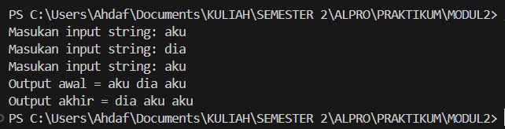
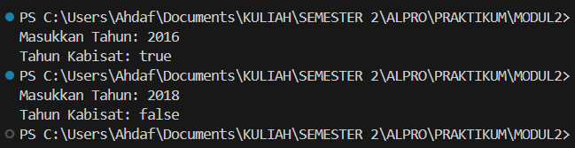

# MODUL 2

Rahmat Ahdaf Albariza (103112430003)
___
#### **Modul 2A**

**nomor 1**
```go
package main

  

import "fmt"

  

func main() {

    var (

        satu, dua, tiga string

        temp string

    )

    fmt.Print("Masukan input string: ")

    fmt.Scanln(&satu)

    fmt.Print("Masukan input string: ")

    fmt.Scanln(&dua)

    fmt.Print("Masukan input string: ")

    fmt.Scanln(&tiga)

    fmt.Println("Output awal = " + satu + " " + dua + " " + tiga)

    temp = satu

    satu = dua

    dua = tiga

    tiga = temp

    fmt.Println("Output akhir = " + satu + " " + dua + " " + tiga)

}
```
Output:



Penjelasan: 
Program di atas meminta pengguna untuk memasukkan tiga string satu per satu. Setelah semua input dimasukkan, program mencetak ketiga string tersebut dalam urutan awal. Kemudian, program menukar posisi string-string tersebut secara bergantian: string pertama pindah ke tempat kedua, string kedua pindah ke tempat ketiga, dan string ketiga pindah ke tempat pertama. Terakhir, program mencetak hasil setelah pertukaran dilakukan. Ini menggunakan variabel sementara `temp` untuk membantu dalam proses penukaran.


**nomor 2**
```go
package main

  

import "fmt"

  

func main() {

    var tahun int

    fmt.Print("Masukkan Tahun: ")

    fmt.Scan(&tahun)

  

    if tahun%400 == 0 || (tahun%4 == 0 && tahun%100 != 0) {

        fmt.Println("Tahun Kabisat: true")

    } else {

        fmt.Println("Tahun Kabisat: false")

    }

}
```
Output:

>

Penjelasan:
Program di atas digunakan untuk mengecek apakah sebuah tahun adalah tahun kabisat atau tidak. Pengguna diminta memasukkan sebuah angka tahun, lalu program akan mengeceknya dengan aturan tahun kabisat. Jika tahun tersebut habis dibagi 400, atau habis dibagi 4 tapi tidak habis dibagi 100, maka tahun tersebut adalah tahun kabisat dan program mencetak "Tahun Kabisat: true". Jika tidak memenuhi aturan itu, maka program mencetak "Tahun Kabisat: false".


**nomor 3**
```go
package main

  

import "fmt"

  

func main() {

    var jejari float64

    fmt.Print("Jejari = ")

    fmt.Scan(&jejari)

  

    volume := (4.0 / 3.0) * 3.1415926535 * (jejari * jejari * jejari)

    luas := 4 * 3.1415926535 * (jejari * jejari)

  

    fmt.Printf("Bola dengan jejari %.0f memiliki volume %.4f dan luas kulit %.4f\n", jejari, volume, luas)

}
```
Output:
>

Penjelasan:
Program di atas digunakan untuk menghitung volume dan luas permukaan bola berdasarkan jejari (radius) yang dimasukkan oleh pengguna. Pertama, program meminta pengguna memasukkan nilai jejari. Kemudian, program menghitung volume bola dengan rumus 4/3 × π × r^3dan luas permukaan bola dengan rumus 4 × π × r^2, di mana π\pix adalah 3.1415926535. Hasil perhitungan kemudian ditampilkan dengan format yang rapi, menampilkan jejari sebagai bilangan bulat dan volume serta luas dengan 4 angka di belakang koma.


**nomor 4**
```go
package main

  

import "fmt"

  

func main() {

    var celsius float64

    fmt.Print("Temperatur Celsius: ")

    fmt.Scan(&celsius)

  

    reamur := (4.0 / 5.0) * celsius

    fahrenheit := (9.0 / 5.0) * celsius + 32

    kelvin := celsius + 273

  

    fmt.Printf("Derajat Reamur: %.0f\n", reamur)

    fmt.Printf("Derajat Fahrenheit: %.0f\n", fahrenheit)

    fmt.Printf("Derajat Kelvin: %.0f\n", kelvin)

}
```
Output:
>

Penjelasan:
Program di atas digunakan untuk mengubah suhu dari Celsius ke tiga satuan lain, yaitu Reamur, Fahrenheit, dan Kelvin. Pertama, program meminta pengguna memasukkan suhu dalam Celsius. Lalu, program menghitung suhu dalam Reamur dengan rumus 4/5 ​× Celsius, suhu dalam Fahrenheit dengan rumus 9/5 ​× Celsius +32, dan suhu dalam Kelvin dengan menambahkan 273 ke Celsius. Terakhir, hasil konversi ditampilkan dengan format tanpa angka desimal.


**nomor 5**
```go
package main

  

import (

    "fmt"

)

  

func main() {

    var a, b, c, d, e int

    var x, y, z byte

  

    // Membaca 5 angka integer

    fmt.Scan(&a, &b, &c, &d, &e)

    fmt.Scanln()

    // Membaca 3 karakter tanpa spasi

    fmt.Scanf("%c%c%c", &x, &y, &z)

  

    // Mencetak karakter dari angka ASCII

    fmt.Printf("%c%c%c%c%c\n", a, b, c, d, e)

    // Mencetak karakter setelahnya dalam ASCII

    fmt.Printf("%c%c%c\n", x+1, y+1, z+1)

}
```
Output:
>

Penjelasan:
Program di atas membaca lima angka dan tiga karakter dari input pengguna. Lima angka pertama dianggap sebagai kode ASCII, lalu program mencetak karakter sesuai dengan nilai ASCII tersebut. Setelah itu, tiga karakter berikutnya dibaca tanpa spasi, dan program mencetak karakter yang merupakan hasil penambahan satu dari setiap karakter yang dimasukkan. Jadi, jika pengguna memasukkan angka-angka yang sesuai dengan huruf ASCII dan karakter seperti 'A', 'B', 'C', maka hasilnya akan menampilkan huruf-huruf yang sesuai dan karakter yang naik satu tingkat dalam kode ASCII.


#### Modul 2B

**nomor 1**
```go
package main

  

import "fmt"

  

func main() {

    var warna1, warna2, warna3, warna4 string

    berhasil := true

  

    for i := 1; i <= 5; i++ {

        fmt.Printf("Percobaan %d: ", i)

        fmt.Scan(&warna1, &warna2, &warna3, &warna4)

  

        if warna1 != "merah" || warna2 != "kuning" || warna3 != "hijau" || warna4 != "ungu" {

            berhasil = false

        }

    }

  

    fmt.Println("BERHASIL:", berhasil)

}
```
Output:
>

Penjelasan:
Program di atas meminta pengguna untuk memasukkan empat warna sebanyak lima kali. Jika dalam semua percobaan warna yang dimasukkan selalu "merah", "kuning", "hijau", dan "ungu" secara berurutan, maka variabel `berhasil` tetap `true`. Namun, jika ada satu saja percobaan yang tidak sesuai, maka `berhasil` akan menjadi `false`. Setelah lima kali percobaan selesai, program mencetak apakah semua percobaan berhasil atau tidak.


**nomor 2**
```go
package main

  

import "fmt"

  

func main() {

    var bunga, pita string

    var count int

  

    for {

        fmt.Printf("Bunga %d: ", count+1)

        fmt.Scan(&bunga)

  

        if bunga == "SELESAI" {

            break

        }

  

        if pita == "" {

            pita = bunga

        } else {

            pita += " - " + bunga

        }

  

        count++

    }

  

    fmt.Println("Pita:", pita+" -")

    fmt.Println("Bunga:", count)

}
```
Output:
>

Penjelasan:
Program ini meminta pengguna untuk memasukkan nama bunga satu per satu. Jika pengguna mengetik "SELESAI", program akan berhenti meminta input. Semua nama bunga yang dimasukkan akan disimpan dalam variabel `pita` dengan tanda pemisah " - ". Program juga menghitung berapa banyak bunga yang dimasukkan. Setelah selesai, program mencetak daftar bunga dengan tambahan tanda " - " di akhir serta jumlah bunga yang telah dimasukkan.


**nomor 3**
```go
package main

  

import "fmt"

  

func main() {

    var berat1, berat2, total float64

  

    for {

        fmt.Print("Masukan berat belanjaan di kedua kantong: ")

        fmt.Scan(&berat1, &berat2)

  

        // Berhenti jika salah satu kantong negatif atau total lebih dari 150 kg

        if berat1 < 0 || berat2 < 0 || total+berat1+berat2 > 150 {

            break

        }

  

        total += berat1 + berat2

  

        // Cek apakah selisih lebih dari 9 kg

        if berat1-berat2 >= -9 && berat1-berat2 <= 9 {

            fmt.Println("Sepeda motor Pak Andi akan oleng: false")

        } else {

            fmt.Println("Sepeda motor Pak Andi akan oleng: true")

        }

    }

  

    fmt.Println("Proses selesai.")

}
```
Output:
>

Penjelasan:
Program ini meminta pengguna untuk memasukkan berat belanjaan di dua kantong secara berulang. Jika salah satu berat negatif atau total berat melebihi 150 kg, program akan berhenti. Setiap kali berat dimasukkan, program mengecek apakah selisih berat antara kedua kantong lebih dari 9 kg. Jika ya, sepeda motor Pak Andi akan oleng (`true`), jika tidak, maka tidak oleng (`false`). Program terus berjalan sampai ada kondisi yang membuatnya berhenti, lalu mencetak "Proses selesai."


**nomor 4**
```go
package main

  

import "fmt"

  

func main() {

    var K int

    fmt.Print("Masukkan nilai K: ")

    fmt.Scan(&K)

  

    // Menghitung hampiran akar 2

    akar2 := 1.0

    for i := 0; i <= K; i++ {

        pembilang := (4*i + 2) * (4*i + 2)

        penyebut := (4*i + 1) * (4*i + 3)

        akar2 *= float64(pembilang) / float64(penyebut)

    }

  

    // Menampilkan hasil dengan 10 angka di belakang koma

    fmt.Printf("Nilai akar 2 = %.10f\n", akar2)

}
```
Output:
>

Penjelasan:
Program ini menghitung nilai hampiran akar 2 menggunakan metode perkalian pecahan. Pengguna diminta memasukkan nilai **K**, yang menentukan berapa kali perhitungan dilakukan. Program memulai dengan nilai awal **1.0**, lalu dalam perulangan sebanyak **K** kali, program menghitung pembilang dan penyebut berdasarkan rumus tertentu dan mengalikannya untuk mendekati akar 2. Hasil akhirnya ditampilkan dengan 10 angka di belakang koma.


#### Modul 2C

**nomor 1**
```go
package main

  

import (

    "fmt"

)

  

func main() {

    var berat int

    fmt.Print("Masukkan berat parsel (gram): ")

    fmt.Scan(&berat)

  

    kg := berat / 1000

    gr := berat % 1000

    biayaKg := kg * 10000

    biayaGr := 0

  

    if kg >= 10 {

        gr = 0 // Berat sisa dihapus jika total lebih dari atau sama dengan 10 kg

    }

  

    if gr <= 500 {

        biayaGr = gr * 5 // Jika sisa berat ≤ 500gr, Rp. 5 per gram

    } else {

        biayaGr = gr * 15 // Jika sisa berat > 500gr, Rp. 15 per gram

    }

  

    totalBiaya := biayaKg + biayaGr

  

    fmt.Printf("\nDetail berat: %d kg + %d gr\n", kg, gr)

    fmt.Printf("Detail biaya: Rp. %d + Rp. %d\n", biayaKg, biayaGr)

    fmt.Printf("Total biaya: Rp. %d\n", totalBiaya)

}
```
Output:
>q

Penjelasan:
Program ini menghitung biaya pengiriman parsel berdasarkan beratnya dalam gram. Pengguna diminta memasukkan berat parsel, lalu program menghitung jumlah kilogram dan gram yang tersisa. Biaya dihitung berdasarkan aturan berikut: setiap **1 kg dikenakan biaya Rp. 10.000**, dan sisa gram dihitung dengan tarif **Rp. 5 per gram jika ≤ 500 gram**, atau **Rp. 15 per gram jika lebih dari 500 gram**. Jika total berat mencapai **10 kg atau lebih**, sisa gram diabaikan. Program kemudian menampilkan rincian berat dan biaya sebelum mencetak total biaya pengiriman.


**nomor 2**
Code yang belum diperbaiki
```go
package main

  

import "fmt"

  

func main() {

    var nam float64

    var nmk string

    fmt.Print(“Nilai akhir mata kuliah: “)

    fmt.Scanln(&nam)

    if nam > 80 {

        nam = “A”

    }

    if nam > 72.5 {

        nam = “AB”

    }

    if nam > 65 {

        nam = “B”

    }

     if nam > 57.5 {

        nam = “BC”

    }

    if nam > 50 {

        nam = “C”

    }

     if nam > 40 {

        nam = “D”

    } else if nam <= 40 {

        nam = “E”

    }

    fmt.Println(“Nilai mata kuliah: “, nmk)

}
```
Jawab:
a. Jika nilai NAM diberikan sebesar 80.1, program akan mengeluarkan "A", padahal seharusnya "AB", jadi program tidak sesuai dengan spesifikasi soal.

b. Kesalahan utama adalah penggunaan if terpisah tanpa else if, sehingga setiap kondisi tetap dicek meskipun yang sebelumnya sudah terpenuhi. Selain itu, batas kategori tidak dibuat dengan benar, seperti pada nilai di atas 80 yang langsung masuk "A" tanpa memperhitungkan batas atasnya.

c. Agar program benar, harus menggunakan else if supaya nilai hanya masuk ke satu kategori yang sesuai. Jika diperbaiki, masukan 93.5, 70.6, dan 49.5 akan menghasilkan keluaran "A", "B", dan "D" seperti yang diharapkan.

Code yang sudah diperbaiki
```go
package main

  

import "fmt"

  

func main() {

    var nam float64

    var nmk string

  

    fmt.Print("Nilai akhir mata kuliah: ")

    fmt.Scanln(&nam)

  

    if nam > 80 {

        nmk = "A"

    } else if nam > 72.5 {

        nmk = "AB"

    } else if nam > 65 {

        nmk = "B"

    } else if nam > 57.5 {

        nmk = "BC"

    } else if nam > 50 {

        nmk = "C"

    } else if nam > 40 {

        nmk = "D"

    } else {

        nmk = "E"

    }

  

    fmt.Println("Nilai mata kuliah:", nmk)

}
```
Output:
>

Penjelasan:
Program ini digunakan untuk menentukan nilai huruf berdasarkan nilai akhir mata kuliah. Pengguna diminta memasukkan nilai akhirnya, lalu program membandingkan nilai tersebut dengan rentang tertentu untuk menentukan huruf yang sesuai. Jika nilainya lebih dari **80**, maka mendapat **A**, jika lebih dari **72.5** mendapat **AB**, dan seterusnya hingga nilai di bawah **40** yang mendapat **E**. Setelah menentukan huruf, program mencetak hasil nilai mata kuliah.


**nomor 3**
```go
package main

  

import "fmt"

  

func main() {

    var b int

    fmt.Print("Bilangan: ")

    fmt.Scan(&b)

  

    fmt.Print("Faktor: ")

    count := 0

    for i := 1; i <= b; i++ {

        if b%i == 0 {

            fmt.Print(i, " ")

            count++

        }

    }

    fmt.Println()

  

    prima := count == 2

    fmt.Println("Prima:", prima)

}
```
Output:
>

Penjelasan:
Program ini digunakan untuk mencari faktor-faktor dari sebuah bilangan dan menentukan apakah bilangan tersebut adalah bilangan prima. Pengguna diminta memasukkan sebuah bilangan, lalu program mencari dan mencetak semua faktor dari bilangan tersebut. Jika jumlah faktornya **hanya 2** (1 dan bilangan itu sendiri), maka bilangan tersebut adalah **bilangan prima** dan program mencetak `true`. Jika lebih dari 2 faktor, maka bukan bilangan prima dan mencetak `false`.