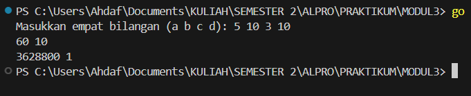
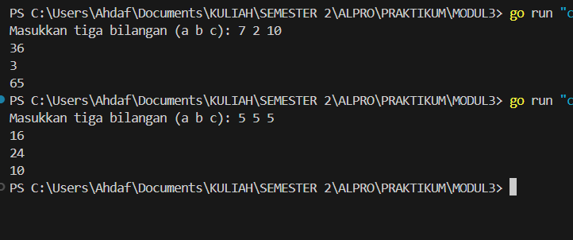
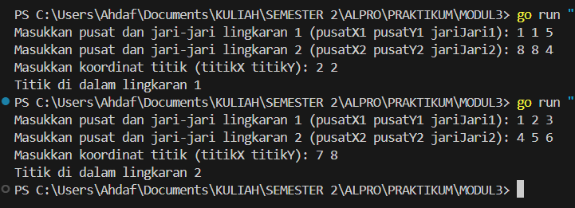

# MODUL 3

Rahmat Ahdaf Albariza (103112430003)
___
#### **nomor 1**
```go
package main

import "fmt"

// Fungsi untuk menghitung faktorial
func factorial(n int) int {
	if n == 0 {
		return 1
	}
	result := 1
	for i := 1; i <= n; i++ {
		result *= i
	}
	return result
}

// Fungsi untuk menghitung permutasi
func permutation(n, r int) int {
	if n < r {
		return 0
	}
	return factorial(n) / factorial(n-r)
}

// Fungsi untuk menghitung kombinasi
func combination(n, r int) int {
	if n < r {
		return 0
	}
	return factorial(n) / (factorial(r) * factorial(n-r))
}

func main() {
	var a, b, c, d int
	fmt.Print("Masukkan empat bilangan (a b c d): ")
	fmt.Scan(&a, &b, &c, &d)

	if a >= c && b >= d {
		fmt.Println(permutation(a, c), combination(a, c))
		fmt.Println(permutation(b, d), combination(b, d))
	} else {
		fmt.Println("Syarat tidak terpenuhi: pastikan a >= c dan b >= d")
	}
}
```
Output:

>

Penjelasan:
Program ini adalah program sederhana dalam bahasa Go untuk menghitung permutasi dan kombinasi dari dua pasang bilangan. Program ini dimulai dengan mendefinisikan tiga fungsi utama: `factorial`, `permutation`, dan `combination`. Fungsi `factorial` digunakan untuk menghitung faktorial dari suatu bilangan dengan melakukan perkalian berturut-turut dari 1 hingga bilangan tersebut. Fungsi `permutation` menghitung banyaknya cara menyusun r objek dari n objek yang tersedia, menggunakan rumus **P(n, r) = n! / (n - r)!**. Sedangkan fungsi `combination` menghitung banyaknya cara memilih r objek dari n objek tanpa memperhatikan urutan, menggunakan rumus **C(n, r) = n! / (r!(n - r)!)**.

Di dalam fungsi `main`, program meminta pengguna untuk memasukkan empat bilangan bulat (`a`, `b`, `c`, dan `d`). Kemudian, program memeriksa apakah nilai `a` lebih besar atau sama dengan `c`, dan `b` lebih besar atau sama dengan `d`. Jika syarat tersebut terpenuhi, program akan mencetak hasil permutasi dan kombinasi dari `a` terhadap `c`, serta `b` terhadap `d`. Jika syarat tidak terpenuhi, program akan menampilkan pesan kesalahan yang menyatakan bahwa nilai yang dimasukkan tidak valid. Dengan cara ini, program memastikan bahwa perhitungan hanya dilakukan untuk kasus yang sesuai dengan aturan matematika kombinatorika.


#### **nomor 2**
```go
package main

import (
	"fmt"
)

// Definisi fungsi matematika
func f(x int) int {
	return x * x
}

func g(x int) int {
	return x - 2
}

func h(x int) int {
	return x + 1
}

// Komposisi fungsi
func fogoh(x int) int {
	return f(g(h(x)))
}

func gohof(x int) int {
	return g(h(f(x)))
}

func hofog(x int) int {
	return h(f(g(x)))
}

func main() {
	var a, b, c int
	fmt.Print("Masukkan tiga bilangan (a b c): ")
	fmt.Scan(&a, &b, &c)

	fmt.Println(fogoh(a))
	fmt.Println(gohof(b))
	fmt.Println(hofog(c))
}
```
Output:

>

Penjelasan:
Program ini adalah program sederhana dalam bahasa Go untuk menghitung hasil dari komposisi tiga fungsi matematika, yaitu **f(x) = x²**, **g(x) = x - 2**, dan **h(x) = x + 1**. Program ini mendefinisikan masing-masing fungsi terlebih dahulu, kemudian membuat tiga fungsi tambahan yang melakukan komposisi dari fungsi-fungsi tersebut.

Fungsi `fogoh(x)` menghitung **f(g(h(x)))**, yaitu pertama menambahkan 1 ke `x` dengan fungsi `h(x)`, lalu hasilnya dikurangi 2 dengan fungsi `g(x)`, dan akhirnya hasilnya dikuadratkan menggunakan fungsi `f(x)`. Fungsi `gohof(x)` menghitung **g(h(f(x)))**, yaitu pertama menghitung kuadrat dari `x` dengan `f(x)`, kemudian hasilnya ditambah 1 dengan `h(x)`, lalu akhirnya dikurangi 2 dengan `g(x)`. Fungsi `hofog(x)` menghitung **h(f(g(x)))**, yaitu pertama mengurangi 2 dari `x` dengan `g(x)`, kemudian hasilnya dikuadratkan dengan `f(x)`, lalu akhirnya ditambah 1 dengan `h(x)`.

Di dalam fungsi `main`, program meminta pengguna untuk memasukkan tiga bilangan bulat (`a`, `b`, dan `c`). Setelah itu, program akan mencetak hasil dari `fogoh(a)`, `gohof(b)`, dan `hofog(c)`, sesuai dengan komposisi fungsi yang telah dibuat sebelumnya. Program ini membantu memahami bagaimana komposisi fungsi bekerja dengan cara sederhana dan mudah dipahami.


#### **nomor 3**
```go
package main

import (
	"fmt"
	"math"
)

// Fungsi untuk menghitung jarak antara dua titik
func hitungJarak(x1, y1, x2, y2 int) float64 {
	return math.Sqrt(float64((x1-x2)(x1-x2) + (y1-y2)(y1-y2)))
}

// Fungsi untuk mengecek apakah titik berada dalam lingkaran
func dalamLingkaran(pusatX, pusatY, jariJari, titikX, titikY int) bool {
	return hitungJarak(pusatX, pusatY, titikX, titikY) <= float64(jariJari)
}

func main() {
	var pusatX1, pusatY1, jariJari1 int
	var pusatX2, pusatY2, jariJari2 int
	var titikX, titikY int

	// Input untuk lingkaran 1
	fmt.Print("Masukkan pusat dan jari-jari lingkaran 1 (pusatX1 pusatY1 jariJari1): ")
	fmt.Scan(&pusatX1, &pusatY1, &jariJari1)

	// Input untuk lingkaran 2
	fmt.Print("Masukkan pusat dan jari-jari lingkaran 2 (pusatX2 pusatY2 jariJari2): ")
	fmt.Scan(&pusatX2, &pusatY2, &jariJari2)

	// Input untuk titik
	fmt.Print("Masukkan koordinat titik (titikX titikY): ")
	fmt.Scan(&titikX, &titikY)

	// Cek posisi titik terhadap lingkaran
	adaDiLingkaran1 := dalamLingkaran(pusatX1, pusatY1, jariJari1, titikX, titikY)
	adaDiLingkaran2 := dalamLingkaran(pusatX2, pusatY2, jariJari2, titikX, titikY)

	// Menentukan keluaran berdasarkan kondisi
	if adaDiLingkaran1 && adaDiLingkaran2 {
		fmt.Println("Titik di dalam lingkaran 1 dan 2")
	} else if adaDiLingkaran1 {
		fmt.Println("Titik di dalam lingkaran 1")
	} else if adaDiLingkaran2 {
		fmt.Println("Titik di dalam lingkaran 2")
	} else {
		fmt.Println("Titik di luar lingkaran 1 dan 2")
	}
}
```
Output:

>

Penjelasan:
Program di atas adalah program sederhana dalam bahasa Go untuk menentukan apakah suatu titik berada di dalam satu atau dua lingkaran. Program ini bekerja dengan cara menerima input dari pengguna berupa koordinat pusat dan jari-jari dua lingkaran, serta koordinat suatu titik, lalu menghitung jarak titik tersebut dari masing-masing pusat lingkaran untuk menentukan posisinya.

Pertama, program mendefinisikan fungsi `hitungJarak()` yang menggunakan rumus jarak Euclidean untuk menghitung jarak antara dua titik dalam bidang koordinat. Fungsi ini mengembalikan nilai berupa bilangan desimal (float64). Selanjutnya, program mendefinisikan fungsi `dalamLingkaran()`, yang memeriksa apakah jarak titik dari pusat lingkaran lebih kecil atau sama dengan jari-jari lingkaran. Jika iya, berarti titik tersebut berada di dalam lingkaran.

Di dalam fungsi `main()`, program meminta pengguna untuk memasukkan tiga set data: pusat dan jari-jari lingkaran pertama, pusat dan jari-jari lingkaran kedua, serta koordinat titik yang ingin diuji. Program kemudian memeriksa apakah titik berada di dalam masing-masing lingkaran dengan memanggil fungsi `dalamLingkaran()`.