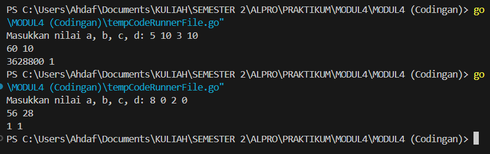
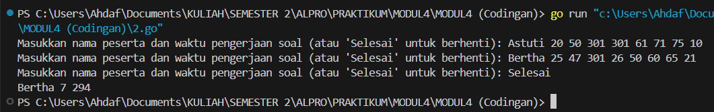
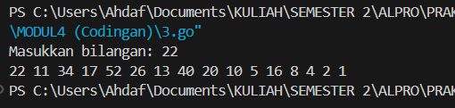

# MODUL 4

Rahmat Ahdaf Albariza (103112430003)
___
#### **nomor 1**
```go
package main

import "fmt"

func factorial(n int) int {
	result := 1
	for i := 2; i <= n; i++ {
		result *= i
	}
	return result
}

func permutation(n, r int) int {
	return factorial(n) / factorial(n-r)
}

func combination(n, r int) int {
	return factorial(n) / (factorial(r) * factorial(n-r))
}

func main() {
	var a, b, c, d int
	fmt.Print("Masukkan nilai a, b, c, d: ")
	fmt.Scan(&a, &b, &c, &d)

	if a >= c && b >= d {
		p_ac := permutation(a, c)
		c_ac := combination(a, c)
		p_bd := permutation(b, d)
		c_bd := combination(b, d)

		fmt.Println(p_ac, c_ac)
		fmt.Println(p_bd, c_bd)
	} else {
		fmt.Println("Input tidak memenuhi syarat a >= c dan b >= d")
	}
}
```
Output:

>

Penjelasan:
Program ini adalah program sederhana dalam bahasa pemrograman Go untuk menghitung **permutasi** dan **kombinasi** dari dua pasangan bilangan yang diberikan oleh pengguna. Program ini diawali dengan mendefinisikan fungsi `factorial(n int) int`, yang digunakan untuk menghitung faktorial dari suatu bilangan `n`. Faktorial dihitung dengan cara mengalikan semua bilangan dari 1 hingga `n`.

Selanjutnya, terdapat dua fungsi, yaitu `permutation(n, r int) int` dan `combination(n, r int) int`. Fungsi `permutation(n, r)` digunakan untuk menghitung permutasi dengan rumus **P(n, r) = n! / (n-r)!**, sedangkan fungsi `combination(n, r)` digunakan untuk menghitung kombinasi dengan rumus **C(n, r) = n! / (r!(n-r)!)**.

Dalam fungsi `main()`, program meminta pengguna untuk memasukkan empat bilangan, yaitu `a`, `b`, `c`, dan `d`. Setelah menerima input, program akan memeriksa apakah `a` lebih besar atau sama dengan `c` dan `b` lebih besar atau sama dengan `d`. Jika syarat tersebut terpenuhi, program akan menghitung permutasi dan kombinasi dari `(a, c)` serta `(b, d)`, lalu mencetak hasilnya. Namun, jika syarat tidak terpenuhi, program akan mencetak pesan **"Input tidak memenuhi syarat a >= c dan b >= d"**.

Dengan cara ini, program memastikan bahwa perhitungan permutasi dan kombinasi hanya dilakukan jika nilai `n` lebih besar atau sama dengan `r`, karena dalam matematika, perhitungan permutasi dan kombinasi tidak valid jika `n < r`.


#### **nomor 2**
```go
package main

import "fmt"

func hitungSkor(waktu [8]int) (int, int) {
	totalWaktu, soalSelesai := 0, 0
	for _, w := range waktu {
		if w <= 300 {
			totalWaktu += w
			soalSelesai++
		}
	}
	return soalSelesai, totalWaktu
}

func main() {
	var nama, pemenang string
	var waktu [8]int
	maksSoal, minWaktu := -1, 999999

	for {
		fmt.Print("Masukkan nama peserta dan waktu pengerjaan soal (atau 'Selesai' untuk berhenti): ")
		fmt.Scan(&nama)
		if nama == "Selesai" {
			break
		}

		for i := 0; i < 8; i++ {
			fmt.Scan(&waktu[i])
		}

		soalSelesai, totalWaktu := hitungSkor(waktu)

		if soalSelesai > maksSoal || (soalSelesai == maksSoal && totalWaktu < minWaktu){
			pemenang, maksSoal, minWaktu = nama, soalSelesai, totalWaktu
		}
	}

	fmt.Printf("%s %d %d\n", pemenang, maksSoal, minWaktu)
}
```
Output:

>

Penjelasan:
Program ini adalah program sederhana dalam bahasa pemrograman Go untuk menentukan pemenang dalam suatu kompetisi pemrograman berdasarkan jumlah soal yang berhasil diselesaikan dan total waktu yang digunakan. Program ini menggunakan array untuk menyimpan waktu pengerjaan soal oleh setiap peserta dan menentukan pemenang berdasarkan kriteria tertentu.

Fungsi `hitungSkor(waktu [8]int) (int, int)` digunakan untuk menghitung jumlah soal yang berhasil diselesaikan dalam batas waktu maksimal (300 menit per soal) dan menghitung total waktu yang dibutuhkan untuk menyelesaikan soal-soal tersebut. Jika waktu pengerjaan soal lebih dari 300 menit, soal dianggap tidak selesai.

Dalam fungsi `main()`, program akan meminta pengguna untuk memasukkan nama peserta beserta waktu pengerjaan untuk 8 soal. Proses ini dilakukan dalam perulangan hingga pengguna memasukkan kata **"Selesai"**. Setiap kali peserta memasukkan data, program akan memanggil fungsi `hitungSkor()` untuk mendapatkan jumlah soal yang selesai dan total waktu yang digunakan.

Setelah itu, program akan menentukan pemenang berdasarkan aturan berikut:

1. Peserta yang menyelesaikan soal terbanyak akan menjadi pemenang.
2. Jika ada lebih dari satu peserta dengan jumlah soal yang sama, maka peserta dengan total waktu pengerjaan lebih kecil akan menjadi pemenang.

Terakhir, setelah semua data peserta dimasukkan, program akan mencetak nama pemenang beserta jumlah soal yang berhasil diselesaikan dan total waktu yang digunakan.

#### **nomor 3**
```go
package main

import "fmt"

func cetakDeret(n int) {
	for n != 1 {
		fmt.Print(n, " ")
		if n%2 == 0 {
			n /= 2
		} else {
			n = 3*n + 1
		}
	}
	fmt.Println(n)
}

func main() {
	var n int
	fmt.Print("Masukkan bilangan: ")
	fmt.Scan(&n)
	cetakDeret(n)
}
```
Output:

>

Penjelasan:
Program ini adalah program sederhana dalam bahasa pemrograman Go untuk mencetak deret bilangan berdasarkan aturan dari **Collatz Conjecture**. Program ini meminta pengguna untuk memasukkan sebuah bilangan bulat positif, kemudian mencetak setiap angka dalam deret hingga mencapai angka **1**.

Fungsi `cetakDeret(n int)` digunakan untuk mencetak deret dengan aturan berikut:

- Jika bilangan saat ini **genap**, maka bilangan selanjutnya adalah hasil pembagian bilangan tersebut dengan **2**.
- Jika bilangan saat ini **ganjil**, maka bilangan selanjutnya dihitung dengan rumus **3n + 1**.
- Proses ini terus berulang hingga bilangan yang dihasilkan bernilai **1**.

Pada fungsi `main()`, program meminta pengguna untuk memasukkan sebuah bilangan dengan perintah `fmt.Scan(&n)`. Kemudian, program akan memanggil fungsi `cetakDeret(n)` untuk mencetak deret bilangan tersebut hingga mencapai angka **1**.