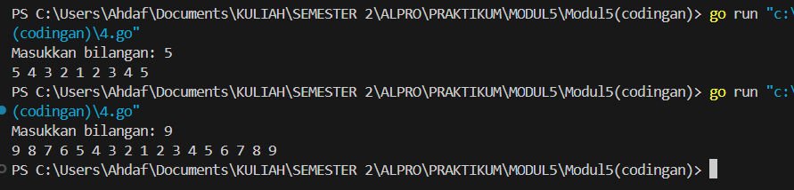

# MODUL 5

Rahmat Ahdaf Albariza (103112430003)
___
#### **nomor 1**
```go
package main

import (
	"fmt"
)

func fibonacci(n int) int {
	if n == 0 {
		return 0
	} else if n == 1 {
		return 1
	} else {
		return fibonacci(n-1) + fibonacci(n-2)
	}
}

func main() {
	fmt.Println("Deret Fibonacci hingga suku ke-10:")
	for i := 0; i <= 10; i++ {
		fmt.Printf("F(%d) = %d\n", i, fibonacci(i))
	}
}
```
Output:

>

Penjelasan:
Program ini adalah implementasi sederhana dari deret Fibonacci dalam bahasa Go. Fungsi `fibonacci(n int) int` digunakan untuk menghitung bilangan Fibonacci ke-n dengan cara rekursif, yaitu dengan memanggil dirinya sendiri untuk menghitung dua bilangan sebelumnya (`fibonacci(n-1)` dan `fibonacci(n-2)`). Jika `n` adalah 0, maka hasilnya 0, dan jika `n` adalah 1, maka hasilnya 1. Pada fungsi `main()`, program mencetak deret Fibonacci dari suku ke-0 hingga ke-10 menggunakan perulangan `for`. Setiap nilai Fibonacci dihitung dengan memanggil fungsi `fibonacci(i)` dan hasilnya ditampilkan ke layar dengan format `F(n) = hasil`.


#### **nomor 2**
```go
package main

import "fmt"

func cetakBintang(n, i int) {
    if i > n {
        return
    }
    
    for j := 0; j < i; j++ {
        fmt.Print("*")
    }
    fmt.Println()
    
    cetakBintang(n, i+1)
}

func main() {
    var n int
    fmt.Print("Masukkan jumlah baris: ")
    fmt.Scan(&n)
    
    cetakBintang(n, 1)
}
```
Output:

>

Penjelasan:
Program di atas adalah program sederhana dalam bahasa Go yang mencetak pola segitiga bintang dengan menggunakan rekursi. Fungsi `cetakBintang(n, i int)` digunakan untuk mencetak bintang sebanyak `i` pada setiap baris, lalu memanggil dirinya sendiri untuk mencetak baris berikutnya dengan jumlah bintang yang bertambah satu hingga mencapai `n` baris. Jika nilai `i` lebih besar dari `n`, fungsi berhenti. Pada fungsi `main()`, pengguna diminta memasukkan jumlah baris yang diinginkan, lalu program memanggil `cetakBintang(n, 1)` untuk mulai mencetak pola bintang dari satu bintang hingga sebanyak `n` baris.

#### **nomor 3**
```go
package main

import "fmt"

func cetakFaktor(n, i int) {
    if i > n {
        return
    }
    if n%i == 0 {
        fmt.Print(i, " ")
    }
    cetakFaktor(n, i+1)
}

func main() {
    var n int
    fmt.Print("Masukkan bilangan: ")
    fmt.Scan(&n)
    
    cetakFaktor(n, 1)
    fmt.Println()
}
```
Output:

>

Penjelasan:
Program di atas adalah program sederhana dalam bahasa Go yang digunakan untuk mencetak faktor-faktor dari sebuah bilangan menggunakan rekursi. Fungsi `cetakFaktor(n, i int)` akan memeriksa apakah `i` adalah faktor dari `n` dengan melihat apakah `n % i == 0`. Jika iya, maka `i` akan dicetak. Fungsi ini kemudian memanggil dirinya sendiri dengan `i+1` sampai `i` lebih besar dari `n`, yang berarti semua faktor sudah dicetak. Dalam fungsi `main()`, pengguna diminta memasukkan sebuah bilangan, lalu program memanggil `cetakFaktor(n, 1)` untuk mencari dan mencetak semua faktor dari bilangan tersebut mulai dari 1.

#### **nomor 4**
```go
package main

import "fmt"


func turunNaik(n, i int) {
    if i == 1 {
        fmt.Print(i, " ")
        return
    }
    fmt.Print(i, " ")
    turunNaik(n, i-1)
    fmt.Print(i, " ")
}

func main() {
    var n int
    fmt.Print("Masukkan bilangan: ")
    fmt.Scan(&n)
    
    turunNaik(n, n)
    fmt.Println()
}
```
Output:

>

Penjelasan:
Program ini adalah program sederhana dalam bahasa Go yang mencetak pola angka menurun lalu naik kembali menggunakan rekursi. Fungsi `turunNaik(n, i int)` akan mencetak angka `i`, lalu memanggil dirinya sendiri dengan `i-1` hingga mencapai angka 1. Setelah mencapai 1, rekursi berhenti dan program mulai mencetak angka kembali naik sampai ke `n`. Dalam fungsi `main()`, pengguna diminta memasukkan sebuah bilangan `n`, lalu program memanggil `turunNaik(n, n)`, sehingga angka akan dicetak dari `n` turun ke 1, lalu naik kembali ke `n`.

#### **nomor 5**
```go
package main

import "fmt"

func cetakGanjil(i, n int) {
    if i > n {
        return
    }
    fmt.Print(i, " ")
    cetakGanjil(i+2, n)
}

func main() {
    var n int
    fmt.Print("Masukkan bilangan: ")
    fmt.Scan(&n)
    
    cetakGanjil(1, n)
    fmt.Println()
}
```
Output:

>

Penjelasan:
Program ini adalah program sederhana dalam bahasa Go yang mencetak bilangan ganjil dari 1 hingga `n` menggunakan rekursi. Fungsi `cetakGanjil(i, n int)` akan mencetak nilai `i`, lalu memanggil dirinya sendiri dengan `i+2`, sehingga hanya bilangan ganjil yang dicetak. Rekursi akan berhenti jika `i` melebihi `n`. Dalam fungsi `main()`, pengguna diminta memasukkan sebuah bilangan `n`, lalu program memanggil `cetakGanjil(1, n)`, sehingga angka ganjil dari 1 hingga `n` akan ditampilkan di layar.

#### **nomor 6**
```go
package main

import "fmt"

func pangkat(x, y int) int {
    if y == 0 {
        return 1
    }
    return x * pangkat(x, y-1)
}

func main() {
    var x, y int
    fmt.Print("Masukkan bilangan x dan y: ")
    fmt.Scan(&x, &y)
    
    hasil := pangkat(x, y)
    fmt.Println("Hasil:", hasil)
}
```
Output:

>

Penjelasan:
Program ini adalah program sederhana dalam bahasa Go yang menghitung hasil perpangkatan `x^y` menggunakan rekursi. Fungsi `pangkat(x, y int) int` bekerja dengan prinsip bahwa jika `y` sama dengan 0, hasilnya adalah 1 (karena bilangan apa pun jika dipangkatkan 0 hasilnya selalu 1). Jika tidak, fungsi akan mengalikan `x` dengan hasil pemanggilan dirinya sendiri dengan `y-1`, hingga `y` mencapai 0. Dalam fungsi `main()`, pengguna diminta memasukkan dua bilangan `x` dan `y`, lalu program memanggil `pangkat(x, y)` untuk menghitung hasilnya dan mencetaknya ke layar.