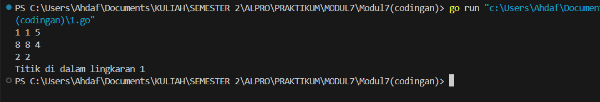
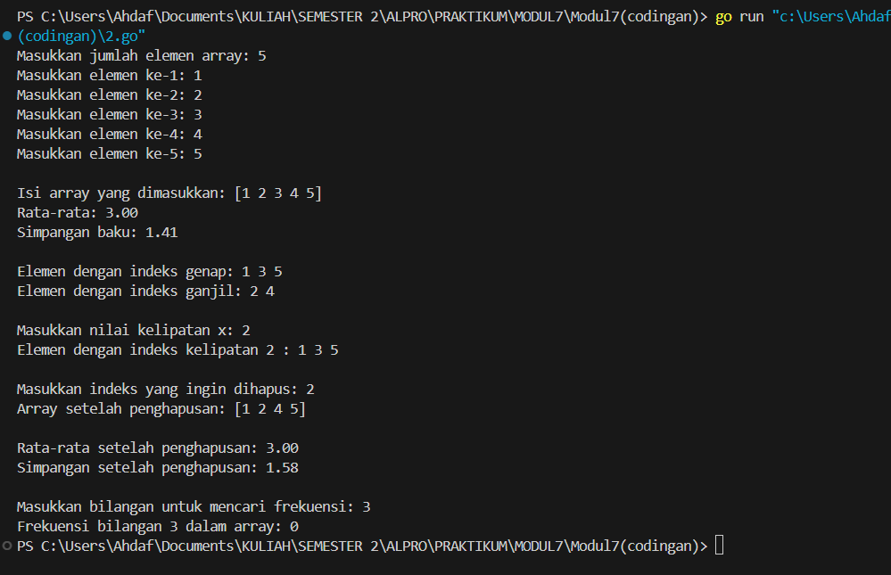
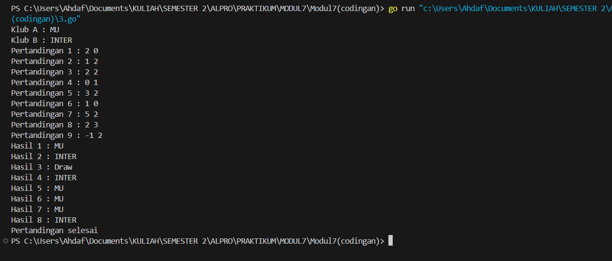
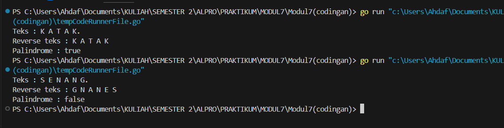

# MODUL 7

Rahmat Ahdaf Albariza (103112430003)
___
#### **nomor 1**
```go
package main

import (
	"fmt"
	"math"
)

type Titik struct {
	x, y int
}

type Lingkaran struct {
	pusat  Titik
	radius int
}

// Fungsi untuk menghitung jarak antara dua titik
func jarak(p, q Titik) float64 {
	dx := float64(p.x - q.x)
	dy := float64(p.y - q.y)
	return math.Sqrt(dx*dx + dy*dy)
}

// Fungsi untuk mengecek apakah sebuah titik ada di dalam lingkaran
func didalam(c Lingkaran, p Titik) bool {
	return jarak(c.pusat, p) < float64(c.radius)
}

func main() {
	var x1, y1, r1 int
	var x2, y2, r2 int
	var px, py int

	// Input sesuai format di gambar
	fmt.Scan(&x1, &y1, &r1)
	fmt.Scan(&x2, &y2, &r2)
	fmt.Scan(&px, &py)

	// Buat lingkaran dan titik
	ling1 := Lingkaran{Titik{x1, y1}, r1}
	ling2 := Lingkaran{Titik{x2, y2}, r2}
	titik := Titik{px, py}

	// Cek posisi titik
	in1 := didalam(ling1, titik)
	in2 := didalam(ling2, titik)

	// Cetak output sesuai ketentuan
	if in1 && in2 {
		fmt.Println("Titik di dalam lingkaran 1 dan 2")
	} else if in1 {
		fmt.Println("Titik di dalam lingkaran 1")
	} else if in2 {
		fmt.Println("Titik di dalam lingkaran 2")
	} else {
		fmt.Println("Titik di luar lingkaran 1 dan 2")
	}
}
```
Output:

>

Penjelasan:
Program di atas adalah program sederhana dalam bahasa Go yang digunakan untuk mengecek apakah sebuah titik berada di dalam satu atau dua lingkaran. Program ini menggunakan dua `struct`: `Titik` untuk menyimpan koordinat x dan y, serta `Lingkaran` untuk menyimpan pusat lingkaran (berupa `Titik`) dan jari-jarinya.

Program memiliki fungsi `jarak()` untuk menghitung jarak antara dua titik, dan fungsi `didalam()` untuk mengecek apakah titik berada di dalam lingkaran dengan membandingkan jarak titik ke pusat lingkaran dengan jari-jari lingkaran.

Di fungsi `main()`, pengguna diminta memasukkan data dua lingkaran (x, y, radius) dan satu titik (x, y). Lalu program menentukan apakah titik itu ada di dalam salah satu atau kedua lingkaran, dan mencetak hasilnya seperti “Titik di dalam lingkaran 1”, atau “Titik di luar lingkaran 1 dan 2”.

___
#### **nomor 2**
```go
package main

import (
	"fmt"
	"math"
)

func hitungRataRata(data []int) float64 {
	sum := 0
	for _, v := range data {
		sum += v
	}
	return float64(sum) / float64(len(data))
}

func hitungSimpanganBaku(data []int) float64 {
	rata := hitungRataRata(data)
	var total float64
	for _, v := range data {
		total += math.Pow(float64(v)-rata, 2)
	}
	return math.Sqrt(total / float64(len(data)))
}

func main() {
	var n int
	fmt.Print("Masukkan jumlah elemen array: ")
	fmt.Scan(&n)

	data := make([]int, n)
	for i := 0; i < n; i++ {
		fmt.Printf("Masukkan elemen ke-%d: ", i+1)
		fmt.Scan(&data[i])
	}

	fmt.Printf("\nIsi array yang dimasukkan: %v\n", data)
	fmt.Printf("Rata-rata: %.2f\n", hitungRataRata(data))
	fmt.Printf("Simpangan baku: %.2f\n", hitungSimpanganBaku(data))

	// Indeks genap dan ganjil
	fmt.Print("\nElemen dengan indeks genap: ")
	for i := 0; i < len(data); i += 2 {
		fmt.Printf("%d ", data[i])
	}
	fmt.Print("\nElemen dengan indeks ganjil: ")
	for i := 1; i < len(data); i += 2 {
		fmt.Printf("%d ", data[i])
	}
	fmt.Println()

	// Kelipatan indeks x
	var x int
	fmt.Print("\nMasukkan nilai kelipatan x: ")
	fmt.Scan(&x)
	fmt.Printf("Elemen dengan indeks kelipatan %d : ", x)
	for i := 0; i < len(data); i++ {
		if i%x == 0 {
			fmt.Printf("%d ", data[i])
		}
	}
	fmt.Println()

	// Hapus elemen pada indeks tertentu
	var del int
	fmt.Print("\nMasukkan indeks yang ingin dihapus: ")
	fmt.Scan(&del)

	if del >= 0 && del < len(data) {
		data = append(data[:del], data[del+1:]...)
		fmt.Printf("Array setelah penghapusan: %v\n", data)
		fmt.Printf("\nRata-rata setelah penghapusan: %.2f\n", hitungRataRata(data))
		fmt.Printf("Simpangan setelah penghapusan: %.2f\n", hitungSimpanganBaku(data))
	} else {
		fmt.Println("Indeks tidak valid.")
	}

	// Frekuensi bilangan
	var target int
	fmt.Print("\nMasukkan bilangan untuk mencari frekuensi: ")
	fmt.Scan(&target)
	count := 0
	for _, v := range data {
		if v == target {
			count++
		}
	}
	fmt.Printf("Frekuensi bilangan %d dalam array: %d\n", target, count)
}
```
Output:

>

Penjelasan:
Program di atas adalah program sederhana dalam bahasa Go yang digunakan untuk melakukan berbagai operasi dasar terhadap array bilangan bulat. Program ini menerima input dari pengguna berupa jumlah elemen array dan elemen-elemennya. Setelah itu, program akan menghitung dan menampilkan **rata-rata** serta **simpangan baku** dari elemen-elemen tersebut menggunakan dua fungsi: `hitungRataRata()` dan `hitungSimpanganBaku()`, yang masing-masing menjumlahkan elemen dan menghitung penyebaran data.

Selain itu, program juga mencetak elemen dengan **indeks genap** dan **ganjil** secara terpisah, lalu meminta nilai `x` untuk menampilkan elemen pada **indeks kelipatan x**. Setelah itu, pengguna dapat memilih untuk **menghapus elemen berdasarkan indeks**, dan program akan menampilkan array baru yang sudah diperbarui serta menghitung ulang rata-rata dan simpangan bakunya.

Terakhir, program juga memungkinkan pengguna memasukkan sebuah bilangan dan menghitung frekuensi kemunculan bilangan tersebut dalam array.

___
#### **nomor 3**
```go
package main

import "fmt"

func main() {
	var klubA, klubB string
	fmt.Print("Klub A : ")
	fmt.Scanln(&klubA)

	fmt.Print("Klub B : ")
	fmt.Scanln(&klubB)

	var hasil []string
	pertandingan := 1

	for {
		var skorA, skorB int
		fmt.Printf("Pertandingan %d : ", pertandingan)
		_, err := fmt.Scanf("%d %d\n", &skorA, &skorB)

		if err != nil || skorA < 0 || skorB < 0 {
			break
		}

		if skorA > skorB {
			hasil = append(hasil, klubA)
		} else if skorB > skorA {
			hasil = append(hasil, klubB)
		} else {
			hasil = append(hasil, "Draw")
		}

		pertandingan++
	}

	for i, v := range hasil {
		fmt.Printf("Hasil %d : %s\n", i+1, v)
	}

	fmt.Println("Pertandingan selesai")
}
```
Output:

>

Penjelasan:
Program di atas adalah program sederhana dalam bahasa Go yang digunakan untuk mencatat hasil pertandingan antara dua klub sepak bola. Program pertama-tama meminta pengguna untuk memasukkan nama dua klub, yaitu **Klub A** dan **Klub B**. Setelah itu, program masuk ke dalam perulangan `for` tanpa batas yang akan terus meminta input **skor pertandingan** antara kedua klub secara berurutan (skorA skorB).

Untuk setiap skor yang dimasukkan, program akan membandingkan skor Klub A dan Klub B. Jika skor Klub A lebih tinggi, maka hasil pertandingan akan dicatat sebagai kemenangan Klub A. Jika skor Klub B lebih tinggi, maka hasil dicatat sebagai kemenangan Klub B. Jika skornya sama, maka hasilnya dianggap **"Draw"** (seri). Semua hasil pertandingan disimpan ke dalam slice `hasil`.

Perulangan akan berhenti ketika input tidak valid, seperti ketika skor negatif atau tidak sesuai format. Setelah perulangan selesai, program akan mencetak seluruh hasil pertandingan satu per satu dengan format **"Hasil n : Klub"**, lalu mencetak pesan "Pertandingan selesai".

___
#### **nomor 4**
```go
package main

import "fmt"

const NMAX = 127
type tabel [NMAX]rune

func isiArray(t *tabel, n *int) {
	var huruf rune
	*n = 0
	fmt.Print("Teks : ")
	for {
		fmt.Scanf("%c", &huruf)
		if huruf == '.' || *n >= NMAX {
			break
		}
		if huruf != ' ' && huruf != '\n' {
			t[*n] = huruf
			*n++
		}
	}
}

func cetakArray(t tabel, n int) {
	for i := 0; i < n; i++ {
		fmt.Printf("%c ", t[i])
	}
	fmt.Println()
}

func balikkanArray(t *tabel, n int) {
	for i := 0; i < n/2; i++ {
		t[i], t[n-1-i] = t[n-1-i], t[i]
	}
}

func palindrom(t tabel, n int) bool {
	var temp tabel
	for i := 0; i < n; i++ {
		temp[i] = t[i]
	}
	var reversed tabel = temp
	balikkanArray(&reversed, n)

	for i := 0; i < n; i++ {
		if temp[i] != reversed[i] {
			return false
		}
	}
	return true
}

func main() {
	var t tabel
	var n int

	isiArray(&t, &n)

	fmt.Print("Reverse teks : ")
	var tCopy tabel
	for i := 0; i < n; i++ {
		tCopy[i] = t[i]
	}
	balikkanArray(&tCopy, n)
	cetakArray(tCopy, n)

	if palindrom(t, n) {
		fmt.Println("Palindrome : true")
	} else {
		fmt.Println("Palindrome : false")
	}
}
```
Output:

>

Penjelasan:
Program di atas adalah program sederhana dalam bahasa Go yang digunakan untuk mengecek apakah sebuah teks (tanpa spasi dan tanpa karakter newline) merupakan **palindrom** atau bukan, serta mencetak teks tersebut dalam urutan terbalik. Program menggunakan array berdimensi tetap (`tabel` dengan panjang maksimum `127`) untuk menyimpan karakter-karakter yang dimasukkan oleh pengguna.

### Penjelasan Fungsi-Fungsi:

- `isiArray()`: Fungsi ini membaca karakter satu per satu dari input hingga ditemukan titik (`.`) atau jumlah karakter mencapai maksimum (`NMAX`). Karakter spasi dan newline (`\n`) diabaikan. Setiap karakter yang valid akan dimasukkan ke dalam array `t`, dan nilai `n` (jumlah karakter yang dimasukkan) akan ditambah.
    
- `cetakArray()`: Mencetak isi array `t` dari indeks 0 sampai `n-1`, memisahkan tiap karakter dengan spasi.
    
- `balikkanArray()`: Membalik urutan isi array `t` dengan cara menukar elemen pertama dengan terakhir, kedua dengan sebelum terakhir, dan seterusnya.
    
- `palindrom()`: Mengecek apakah teks merupakan palindrom. Fungsi ini membuat salinan array, membalik salinan tersebut, lalu membandingkan setiap karakter pada array asli dengan array yang dibalik. Jika semua karakter cocok, maka fungsi mengembalikan `true`.
    

### Proses di Fungsi `main()`:

1. Program meminta input teks melalui fungsi `isiArray()`, dan menyimpannya di array `t`.
    
2. Program membalik teks menggunakan `balikkanArray()` dan mencetak hasilnya.
    
3. Kemudian program memanggil fungsi `palindrom()` untuk memeriksa apakah teks tersebut palindrom dan mencetak hasilnya sebagai `true` atau `false`.

___